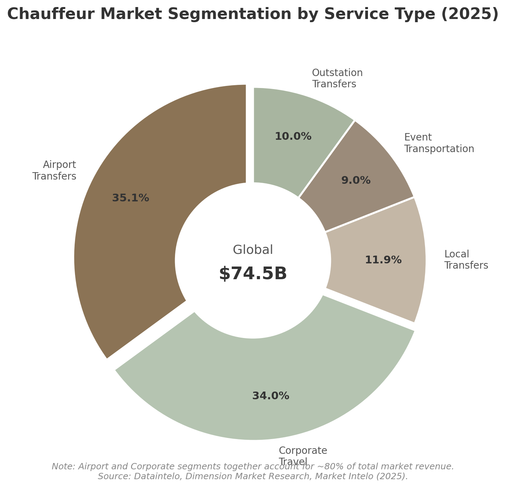
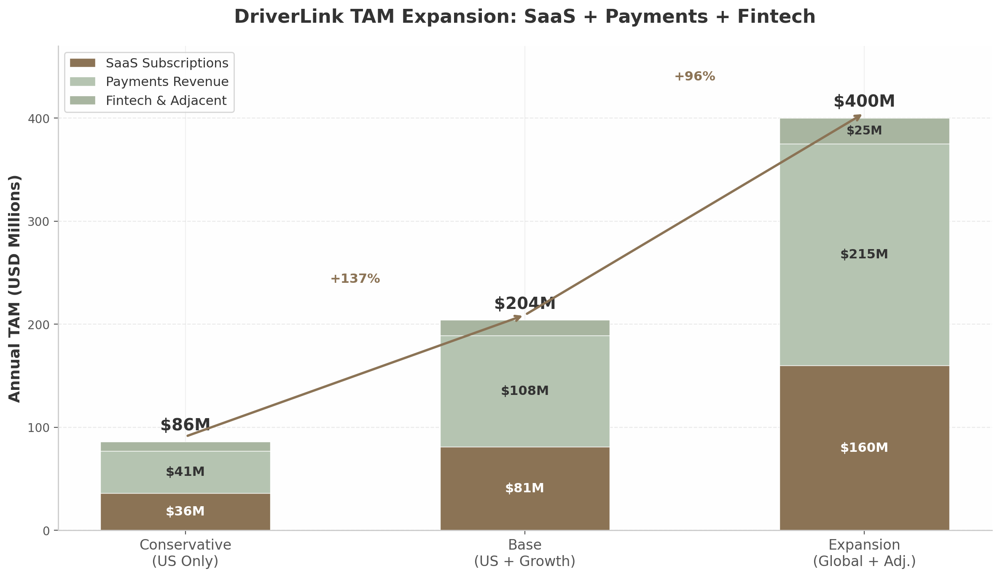

# 1. Market Opportunity & TAM Analysis

The ground transportation industry presents one of the largest remaining whitespace opportunities in vertical SaaS. The global chauffeur services market generates an estimated $74.5 billion in annual revenue, yet the technology infrastructure serving independent operators — who comprise the vast majority of the industry — remains effectively nonexistent. This chapter establishes the market's scale, demonstrates its structural fragmentation, and quantifies the total addressable market for DriverLink through both bottom-up and comparable-based methodologies. The analysis concludes that DriverLink confronts a $30 million to $144 million SaaS TAM in the United States alone, with embedded payments and fintech services expanding the opportunity to $108 million–$500 million — a trajectory validated by Toast, Shopify, and GlossGenius in analogous verticals.

## 1.1 Global Chauffeur Market Overview

### Market Sizing: A $74.5 Billion Industry with Significant Variance

The global chauffeur car market spans a range of definitional scopes depending on whether estimates include adjacent premium mobility categories. Dataintelo pegs the pure chauffeur services market at $46.8 billion in 2025, while Dimension Market Research estimates $83.2 billion for 2026 — the divergence largely attributable to whether premium ride-hail tiers (Uber Black, Uber Lux), luxury car rentals with drivers, and corporate contract vehicles are included [^103^][^2^]. MAK Data Insights produces the highest estimate at $85.4 billion, whereas Growth Market Research narrows the focus to limousine-only services at $10.8 billion in 2024 [^5^][^16^]. For the purposes of this analysis, a conservative midpoint of approximately $60–70 billion represents the core addressable market for traditional chauffeur and executive car services.

| Source | 2025–2026 Estimate | 2034–2035 Forecast | CAGR | Notes |
|---|---|---|---|---|
| Dataintelo | $46.8B [^103^] | $89.3B (2034) | 7.4% | Pure chauffeur services |
| Dimension Market Research | $83.2B (2026) [^2^] | $284.3B (2035) | 14.6% | Includes adjacent premium categories |
| Market Intelo | $52.4B [^12^] | $98.7B (2034) | 7.3% | Core chauffeur services |
| MAK Data Insights | $85.4B [^5^] | $152.7B (2035) | 6.4% | Broad definitional scope |
| Growth Market Reports | $10.8B (2024) [^16^] | $18.6B (2033) | 6.2% | Limousine services only |
| **Consensus Midpoint** | **$60–70B** | **$120–150B** | **7–8%** | **Serviceable market boundary** |

The United States represents the largest single national market, valued at $10.8 billion in 2025 and projected to reach $22.7 billion by 2035 at a 7.7% CAGR [^2^]. North America as a whole commands 41.5–44% of global chauffeur revenue, driven by corporate travel density, premium airport transfer demand, and a cultural preference for executive car services in major business corridors [^2^]. The United States alone hosts over 3,200 licensed limousine and chauffeured transportation companies, with the actual number of operators substantially higher once unlicensed independents and owner-operators are counted [^103^].

The regional distribution reveals North America's dominance but also identifies meaningful growth opportunities elsewhere. Europe holds approximately 22% of global revenue, anchored by London, Paris, Frankfurt, and Zurich as corporate travel hubs. The European market benefits from established regulatory frameworks for hire vehicles — such as Germany's P-Schein requirement and France's VTC licensing system — that create natural barriers to entry, protecting independent operators from platform commoditization. Asia-Pacific accounts for 20%, with significant acceleration expected as business travel normalizes post-pandemic and luxury tourism expands in Southeast Asia. The Middle East, Africa, and Latin America collectively represent 14%, with the Gulf states showing particularly strong premium transport demand driven by ultra-high-net-worth visitor flows [^5^][^12^].

### Growth Drivers: Corporate Travel Recovery and Premium Experience Demand

Three converging forces are expanding the addressable market. First, corporate travel spending reached a record $1.47 trillion globally in 2024 and is projected to hit $1.57 trillion in 2025, with ground transportation representing 11–12% of total expenditure [^314^]. The Global Business Travel Association (GBTA) projects that spending will continue growing at 6.6% annually, with executive and VIP segments outpacing the broader market [^320^]. Notably, 81% of business travelers report traveling the same or more in 2024 compared with 2019, and 86% believe business travel is worthwhile in achieving objectives — strong indicators of sustained demand [^388^].

Second, the corporate travel policy environment is becoming more permissive for premium ground transport. A GBTA/NLA survey found that 93% of travel managers permit chauffeured transportation in high-risk or developing countries, 90% for employees with accessibility needs, 82% for client and customer transport, and 62% for recruiting [^339^]. Safety overwhelmingly dominates cost as the priority — 73% of travel managers rank it as the single greatest priority in ground transportation programs [^339^]. This safety-first orientation plays directly to independent chauffeurs' strengths over rideshare alternatives.

Third, platform investment and consolidation at the top of the market validate the sector's attractiveness. Uber agreed to acquire Blacklane in March 2026 for approximately EUR 900 million; Blacklane operated across more than 500 cities in over 60 countries at the time of the deal [^2^]. Lyft acquired TBR Global Chauffeuring in October 2025 for approximately $110 million [^2^]. These acquisitions signal that even the largest mobility platforms view premium chauffeur services as a critical strategic gap — one that cannot be addressed through algorithmic ride-hailing alone.

### Market Segmentation: Airport and Corporate Travel Dominate

Service type segmentation reveals where demand concentrates. Airport transfers command the largest share at 34.2–47.2% of revenue, reflecting the structural predictability of flight-arrival-driven demand [^12^][^2^]. Corporate travel follows at 24.8–54.1%, depending on definitional scope [^12^][^2^]. Together, these two segments account for approximately 60–80% of total market revenue, with significant implications for SaaS targeting: drivers serving these segments require scheduling, recurring booking management, flight tracking integration, and corporate invoicing capabilities most urgently.

Online and app-based booking channels now account for 62.3% of total reservations globally, up from approximately 44% in 2020 [^103^]. However, this figure masks a critical structural divide: while large platforms (Blacklane, Uber Black, Addison Lee) capture the majority of online bookings, individual small operators report only 10–20% of their business through online reservation systems, with some reaching 55% at best [^107^]. Multiple operators surveyed by Chauffeur Driven Magazine reported figures as low as 10% of reservations through online portals, with the majority still arriving via phone and email [^107^]. This divergence represents a massive latent demand for digital booking infrastructure among independent operators — the precise gap DriverLink is designed to fill. By 2034, online channels are projected to capture 78% of all transactions; operators without digital booking capabilities face an existential competitive threat [^103^].

## 1.2 Market Fragmentation — The SaaS Opportunity

### Extreme Fragmentation: The Classic Vertical SaaS Profile

The chauffeur industry exhibits precisely the structural characteristics that vertical SaaS platforms have successfully exploited in restaurants, fitness, beauty, and e-commerce. Small businesses with fewer than 5 vehicles make up 70% of the limousine industry, with the average fleet size for small operators at just 3.5 vehicles [^122^]. No single player operates more than 5% of the business on a national level [^120^]. The industry resembles a long tail of micro-operators — exactly the conditions in which Toast (restaurants), GlossGenius (beauty), and Shopify (e-commerce) achieved scale by providing purpose-built infrastructure to underserved independents.

| Fragmentation Metric | Value | Source |
|---|---|---|
| Operators with <5 vehicles | 70% of industry [^122^] | WifiTalents 2026 |
| Operators with <$500K annual revenue | 80% [^120^] | LCT Survey |
| Operators with <$100K annual revenue | 56% [^120^] | LCT Survey |
| Independent contractors among chauffeurs | ~45–46% [^120^] | LCT Survey |
| Largest national player's market share | <5% [^120^] | Industry analysis |
| Self-employed for-hire drivers (BTS) | 91.5% [^40^] | U.S. BTS 2022 |
| Small fleets using manual scheduling | 70% [^14^] | Ground Alliance 2025 |
| Median annual wage (chauffeurs) | $36,670 [^121^] | BLS May 2024 |
| Projected employment growth (2024–2034) | 9% [^121^] | BLS |

The 80% of operators generating under $500,000 annually are precisely the segment least likely to afford or implement enterprise-grade fleet management software [^120^]. Most rely on a patchwork of generic tools: Google Calendar for scheduling, WhatsApp for client communication, Square or PayPal for payments, and spreadsheets for record-keeping [^23^]. This tool fragmentation creates the exact conditions that vertical SaaS has repeatedly disrupted — a large population of independent operators spending excessive time on administrative tasks that purpose-built software can automate.

### The Core Addressable Market: 25,000–40,000 Independent Chauffeurs

Synthesizing data from multiple government and industry sources yields an estimate of 25,000 to 40,000 independent chauffeurs and owner-operators in the United States who constitute DriverLink's core addressable market. The Bureau of Labor Statistics tracks approximately 370,400 total taxi, ride-hailing, and chauffeur drivers nationally [^119^], while the Bureau of Transportation Statistics reports that 91.5% of taxi drivers — including rideshare operators — are self-employed [^40^]. NAICS code 485320 (Limousine Service) identifies 7,963 companies employing 37,281 people [^61^], but this undercounts the true number of operators because it excludes sole proprietors, independent contractors not on payroll, and drivers affiliated with dispatch networks but operating their own vehicles.

The estimate of 25,000–40,000 independents encompasses three overlapping groups: approximately 5,600–8,400 small operators with fewer than 5 vehicles (the 70% segment of the ~8,000–12,000 total operators), 3,000–5,000 true owner-operators who drive themselves with no employees, and 10,000–20,000 independent contractors affiliated with networks but operating effectively as their own businesses [^68^][^40^]. While no authoritative source provides a precise count, the directional magnitude is sufficient for TAM estimation: this is a market of tens of thousands, not hundreds or thousands.

### Software Penetration: The $500 Million Gap

The critical insight validating the SaaS opportunity is the chasm between the total market and software penetration. The global limo software market is valued at only $500 million in 2025 — representing roughly 0.6–1.0% of the total chauffeur services market [^30^]. This is dramatically lower than vertical SaaS penetration in restaurants (Toast holds approximately 15% of payment volume share), e-commerce (Shopify powers roughly 10% of global e-commerce), or fitness (Mindbody serves an estimated 28% of boutique fitness studios) [^31^][^72^].

The reason for this under-penetration is straightforward: existing solutions target fleet operators, not individual drivers. Limo Anywhere — the industry's most established software provider — prices at $89 to $5,999 per month with features designed for dispatch centers managing multiple vehicles and complex routing [^140^]. Ground Alliance, Samsara, and Verizon Connect similarly focus on fleet telematics and enterprise logistics [^14^][^106^]. No purpose-built platform exists for the single-driver operator who needs simple booking management, client CRM, and payment processing — the exact "Squarespace for chauffeurs" positioning that DriverLink occupies.

## 1.3 Independent Driver Economics

### The Earnings Premium: $50–$175/Hour vs. $20–$25/Hour

Independent chauffeurs operate in a fundamentally different economic stratum from platform-based rideshare drivers. Hourly rates for professional chauffeur services range from $50–$75 in smaller markets to $85–$175 in premium tier-1 cities, depending on vehicle class [^1^][^2^]. A New York City black car sedan starts at $85 per hour with a three-hour minimum ($255 floor), while luxury SUVs command $115–$170 per hour [^1^]. Washington DC sedan rates range $65–$95 per hour, SUVs $85–$110 per hour [^2^]. Chicago sedan service averages $65 per hour, with airport transfers from O'Hare to downtown at $85–$100 per trip [^3^].

By contrast, Uber and Lyft drivers earn $17–$24 per hour on average before expenses, with net take-home pay substantially lower after accounting for fuel, maintenance, and depreciation [^5^]. A 2024 Toronto city analysis based on 84 million trips found median net earnings of $5.97–$15.35 per hour, depending on methodology, with over 57% of drivers earning below minimum wage on a per-engaged-hour basis [^6^]. Even Uber Black drivers — the premium tier most comparable to independent chauffeurs — typically gross $30–$50 per hour during active driving time, with net earnings of $50,000–$75,000 annually in top markets [^9^].

### Cost Structure: The Independence Tax

Independence carries significant fixed costs that platform drivers do not bear. Commercial livery insurance represents the single largest expense shock, ranging from $5,000 to $21,600 annually depending on jurisdiction and vehicle type [^11^][^10^]. For-hire vehicles in New York carry commercial auto premiums of $5,000–$15,000 per vehicle per year, driven by TLC minimums, high mileage, and passenger liability exposure [^11^]. Vehicle acquisition or leasing adds $14,400–$30,000 annually, with luxury vehicles commanding the upper end of that range [^12^]. Licensing and permits ($500–$3,000 per year), parking and tolls ($1,000–$15,000 in urban markets), and marketing ($1,000–$10,000) further erode margins [^12^].

| Cost Category | Annual Cost Range | % of Typical Revenue |
|---|---|---|
| Vehicle lease/payment | $14,400–$30,000 | 15–30% |
| Commercial livery insurance | $5,000–$21,600 [^11^] | 5–22% |
| Fuel | $3,000–$8,000 | 3–8% |
| Maintenance & repairs | $2,000–$5,000 | 2–5% |
| Licensing & permits | $500–$3,000 | 0.5–3% |
| Parking & tolls | $1,000–$15,000 | 1–15% |
| Marketing/website | $1,000–$10,000 | 1–10% |
| Booking/payment software | $500–$3,000 | 0.5–3% |
| **Total estimated expenses** | **$27,400–$95,600** | **27–96%** |

A full-time independent chauffeur in a tier-2 city working 40 hours per week at $75 per hour with 60% utilization (24 billable hours) generates approximately $93,600 in gross annual revenue. After vehicle, insurance, fuel, and other expenses totaling roughly $35,000–$45,000, net income lands in the $48,000–$58,000 range — comparable to a skilled trade but with substantially more operational risk. Top-tier NYC operators with corporate accounts can earn $80,000–$120,000 net, but these represent the upper decile, not the median [^1^][^12^].

### The Independence Trade-Off

The defining characteristic of independent chauffeur economics is the trade-off between per-trip margin and demand consistency. Platform drivers sacrifice 40–65% of each fare to the algorithm but receive a steady stream of ride requests [^13^][^14^]. Independent chauffeurs capture the full fare but must build and maintain their own customer pipelines — a challenge for which most drivers are unprepared. The transportation and warehousing industry posts a 47.4% five-year business failure rate, placing it in the bottom half of all industries for survival [^36^]. Primary failure drivers include cash flow disruption (56% of small businesses wait on unpaid invoices), customer acquisition difficulty, and regulatory complexity [^25^][^38^].

This trade-off is precisely where vertical SaaS creates value. By providing independent drivers with the booking, CRM, invoicing, and payment tools they lack, DriverLink addresses the operational burden that drives nearly half of independent operators out of business within five years. The platform does not merely offer convenience — it materially improves survival odds by systematizing the administrative functions that entrepreneurs in other verticals already take for granted.

## 1.4 TAM Sizing for DriverLink

### Bottom-Up TAM: Independent Drivers × ARPU

Following the proven methodology employed by Toast, Slice, and GlossGenius, DriverLink's TAM is calculated as the product of the addressable independent driver population and average revenue per user (ARPU), with subsequent expansion through embedded payments and fintech services.

The addressable driver base is estimated at 25,000–40,000 independent chauffeurs and owner-operators in the United States. ARPU benchmarking against comparable vertical SaaS platforms suggests a SaaS subscription range of $50–$150 per month ($600–$1,800 annually), with an average blended ARPU of approximately $100 per month ($1,200 annually). GlossGenius charges $24–$148 per month for beauty professionals, with payments revenue roughly matching subscription revenue at scale [^57^]. Limo Anywhere targets fleet operators at $89–$5,999 per month — pricing that excludes the vast majority of single-driver operators [^140^]. Toast achieves $11,500 in actual ARPU (2023) with a theoretical potential exceeding $30,000 when fintech services are included [^72^].

| TAM Scenario | Driver Count | SaaS ARPU/Year | Payments ARPU/Year | SaaS TAM | Total TAM (SaaS + Payments) |
|---|---|---|---|---|---|
| Conservative (25K drivers) | 25,000 | $1,200 | $1,000 | $30M | $55M |
| Base (35K drivers) | 35,000 | $1,200 | $1,500 | $42M | $94.5M |
| Optimistic (40K drivers) | 40,000 | $1,800 | $2,000 | $72M | $152M |
| Expansion (global + adj.) | 100,000 | $1,200 | $1,500 | $120M | $270M |

### Payments and Fintech: The 2–3x Multiplier

The pure SaaS TAM — while sufficient to support a meaningful business — dramatically understates the true opportunity. Every comparable vertical SaaS platform has discovered that payments and fintech revenue eventually surpass subscription revenue by multiples. Toast derives approximately 85% of revenue from payments processing, 15% from subscriptions [^72^]. Shopify generates 74% from merchant solutions (primarily payments), 26% from subscriptions [^32^]. GlossGenius collects 2.6% on every card transaction, with payments revenue contributing roughly half of total value at scale [^57^]. Slice processes $50 billion in annual order flow through independent pizzerias; at a 1% take rate, that represents a $500 million revenue opportunity — more than 5x its SaaS subscription value [^58^].

For DriverLink, the payments multiplier operates as follows. An independent chauffeur processing $100,000 in annual bookings through the platform generates $2,600 in processing fees at a 2.6% rate (the GlossGenius benchmark). Assuming the platform captures a 0.5–1.0% spread on processed volume, payments revenue alone equals $500–$1,000 per driver per year — approaching or matching the SaaS subscription. Adding insurance commissions (15–30% of premium on $5,000–$15,000 policies), embedded lending, and other fintech services could push total ARPU to $3,000–$5,000 per driver at full penetration.

The formula generalizes: **Total TAM = (Independent Drivers) × (SaaS ARPU + Payments ARPU + Fintech ARPU)**. Under the base scenario of 35,000 drivers, this yields $42 million in SaaS TAM, $52.5 million in payments TAM (at 1.5% take rate on $100,000 average GMV), and incremental fintech revenue — for a combined addressable market of approximately $108 million. Under the expansion scenario that includes global markets (3× the US addressable base) and adjacent verticals (luxury car rental, tour operators, personal drivers), the total TAM reaches an estimated $300–$500 million [^36^].

### Comparable Validation: How Toast, Shopify, and Slice Prove the Model

The TAM expansion pattern observed in analogous verticals provides strong empirical validation for DriverLink's trajectory. Toast expanded its TAM from 438,000 locations at IPO to 1.4 million locations globally by 2024 — a 60% increase driven by international expansion and adjacent food-and-beverage retail categories [^72^]. The company now holds approximately 15% of payment volume share in the US restaurant market, yet has penetrated only 13% of its US TAM by location count — demonstrating the long runway available even after achieving significant scale [^81^].

Slice illustrates the power of the SaaS-plus-payments model in a fragmented artisan vertical. The US pizza market generates approximately $44 billion in annual revenue across 75,000 shops, of which roughly 40,000 are independent pizzerias. Slice serves over 19,000 of these independents and has exceeded $100 million in ARR [^58^][^60^]. The company's CRO has noted that there is "$50 billion worth of order flow and spend through those pizzerias" — a payments TAM more than 10x the SaaS opportunity [^60^]. Shopify's current TAM stands at $849 billion, though this reflects GMV-based methodology rather than subscription value; the more relevant metric is Shopify's 2% penetration in its $404 billion core serviceable addressable market, suggesting years of growth remain even at enormous scale [^32^].

| Company | Vertical | TAM Methodology | SaaS ARPU | Payments Take Rate | TAM Expansion |
|---|---|---|---|---|---|
| Toast | Restaurants | 1.4M locations × ARPU [^72^] | $11.5K actual / $30K potential | Embedded | 6× in 5 years |
| Shopify | E-commerce | GMV × take rate [^32^] | $29–$2,300/mo | 2–3% | 3× via merchant solutions |
| Slice | Pizzerias | 40K shops × ARPU + order flow [^58^] | $1.5K–$3K/yr | ~1% of GMV | 5× via payments |
| GlossGenius | Beauty | 70K+ locations × ARPU + payments [^57^] | $24–$148/mo | 2.6% | 3× via payments |
| Mindbody | Fitness | 61K studios × ARPU + payments [^31^] | ~$11K/yr | 80 bps | 2.5× via payments |

The comparable data points to a consistent pattern: vertical SaaS platforms targeting fragmented independent operators achieve initial product-market fit with software subscriptions, then expand TAM by 2–6x over five years through embedded payments and adjacent financial services. The chauffeur industry shares the structural characteristics — fragmentation, cash-heavy transactions, underserved independents, relationship-based commerce — that enabled this pattern in every precedent vertical. The $500 million limo software market, set against a $50+ billion total industry, represents one of the lowest SaaS penetration ratios in the economy — and one of the largest remaining opportunities for vertical platform consolidation [^30^].

The implications for DriverLink are unambiguous. A conservative US-first strategy targeting 25,000–40,000 independent chauffeurs with a SaaS-plus-payments stack addresses a $55–$152 million TAM — sufficient to support a venture-scale business at 10–20% penetration. Layering in insurance brokerage, embedded lending, and global expansion pushes the total addressable market toward $300–$500 million, on par with the scale that Slice and GlossGenius have demonstrated achievable in similarly fragmented verticals. The EU Platform Work Directive, effective December 2026, will force ride-hail platforms to reclassify drivers as employees across 27 countries — creating a regulatory collapse event that could drive thousands of premium drivers toward independent SaaS tools and away from employment-nexus platforms. The market exists, the independents are underserved, the regulatory winds are shifting favorably, and the playbook is proven.
