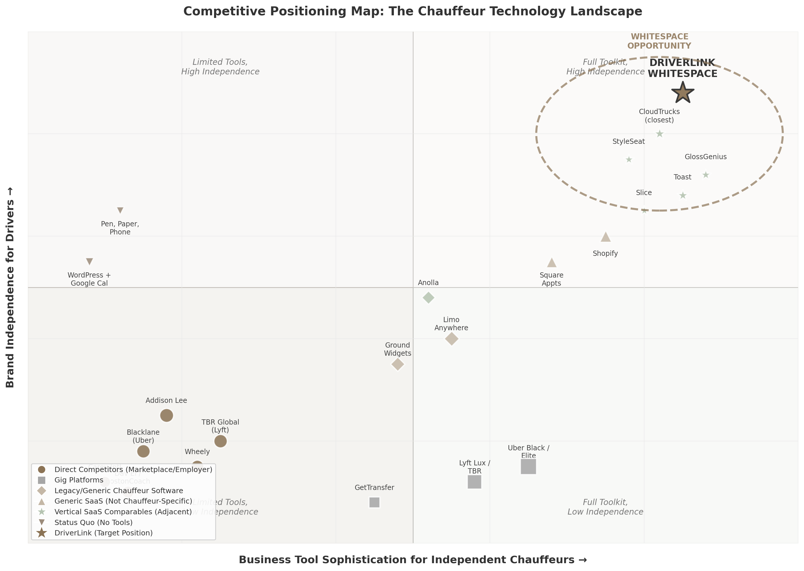

## 2. Competitive Landscape

The global chauffeur services market, valued at $52.4 billion in 2025 and projected to reach $98.7 billion by 2034 [^12^], exhibits a striking paradox: it is one of the most technologically underserved sectors in the transportation economy. The top ten operators collectively capture only 22-25% of global revenue [^103^], leaving the vast majority of the market to independent operators running fleets of one to five vehicles. Yet no dominant vertical SaaS platform purpose-built for these independents exists. This section maps the competitive terrain — direct competitors, indirect alternatives, and adjacent platform precedents — to identify exactly where the whitespace opportunity sits and why existing players are structurally incapable of addressing it.

### 2.1 Direct Competitors: Global Chauffeur Platforms

Direct competitors are defined as platforms that connect chauffeur supply with passenger demand. All share a critical limitation: they operate as consumer-facing marketplaces or employer models, not as business operating systems for independent drivers. Every direct competitor treats chauffeurs as supply-side inputs rather than independent business owners who need tooling, branding, and financial services.

**Blacklane** operates in over 500 cities across more than 60 countries and was acquired by Uber in March 2026 for an undisclosed sum [^18^]. Founded in Berlin in 2011, the company built its network on a partner model that offers chauffeur companies "complete schedule control" and "reliable direct payment" with no commission or fees [^29^]. Partners gain access to large corporate clients, dedicated support, and training modules. However, Blacklane's minimum bar is owning and operating a registered chauffeur company — it does not serve individual independent chauffeurs. More importantly, Blacklane provides zero SaaS tools for partners to run their own businesses: no client CRM, no booking software, no payment processing, no insurance or financing products. It is purely a demand platform. Uber's acquisition of Blacklane, announced less than two weeks after Uber Elite's March 12, 2026 launch [^48^], signals that even Uber recognized it could not algorithmically replicate fifteen years of luxury hospitality expertise [^115^]. Yet the combined entity remains a consumer-facing brand; Uber Elite drivers are still gig workers within Uber's ecosystem.

**Wheely** expanded to New York City in March 2026, its U.S. debut, with plans to expand to Texas, Washington D.C., Miami, and Palm Beach over the next five years [^12^]. The London-headquartered service targets exclusively business elites and high-net-worth individuals. Drivers wear suits and ties, sign non-disclosure agreements, and complete three days of five-star hotel-inspired hospitality training [^12^]. Wheely became the Official VIP Chauffeur Partner of Frieze art fairs across New York, London, and Los Angeles in May 2026 [^26^]. Like Blacklane, Wheely sources vehicles from independent contractors but operates as a consumer-facing brand — drivers do not build their own brand or client relationships. Wheely offers trips, not business tools.

**Addison Lee** achieved turnover of £224.8 million in FY2023 with Adjusted EBITDA of £27.4 million (up 41%), rising to £231.2 million in revenue with £1.8 million pre-tax profit in FY2024 [^20^] [^25^]. The company operates over 7,500 drivers in London and invested more than £80 million over three years to upgrade its fleet with 600 plug-in hybrid VW multivans and 1,000 fully electric VW ID.4s. Addison Lee operates an employer model — its drivers are supply-side workers, not independent business owners. It was acquired by ComfortDelGro for £269.1 million in October 2024 [^25^]. The company offers no SaaS platform for independent chauffeurs; it is an operator, not a software provider.

**TBR Global Chauffeuring** was acquired by Lyft for £83 million (~$110 million) in October 2025 [^14^] [^17^]. TBR operates across 120+ countries and 3,000+ cities, serving Fortune 500 companies, investment banks, and major global events [^17^]. The company specializes in "high-touch, complex events, financial roadshows" with "a high level of offline bookings," per CEO Craig Chambers [^20^]. Critically, Chambers confirmed there will be no integration with Lyft's app technology: "The Lyft app is an on-demand piece of technology; TBR is much more high-touch" [^20^]. TBR serves corporate clients through a curated network of fleet partners. It is not, and does not aspire to be, a SaaS tool for individual independent chauffeurs.

**Table 1: Direct Competitor Comparison**

| Platform | Scale | Revenue | Model | Driver Relationship | SaaS for Drivers | Ownership |
|---|---|---|---|---|---|---|
| Blacklane [^18^] | 500+ cities, 60+ countries | Not disclosed (est. EUR 300M) | Partner marketplace | Chauffeur companies only | None | Uber (acquired Mar 2026) |
| Wheely [^12^] | London, Paris, Dubai, NYC | Not disclosed | Luxury on-demand | Independent contractors | None | Private |
| Addison Lee [^20^] | 7,500+ drivers, London | £231.2M (FY2024) | Employer/operator | Employees | None | ComfortDelGro |
| TBR Global [^17^] | 3,000+ cities, 120 countries | £83M (acquisition price) | Managed marketplace | Fleet partners | None | Lyft |
| Carey International [^81^] | 1,000+ cities, 55+ countries | Not disclosed | Affiliate network | Affiliated operators | None | Private |
| Dav El/BostonCoach [^87^] | 500+ markets, 25,000+ vehicles | $54.5M (estimated) | Employer + affiliates | Mixed | None | Marcou Transportation |

The pattern across all six direct competitors is identical: each captures value by controlling the customer relationship and treating chauffeurs as a replaceable supply input. None provide business infrastructure — scheduling, CRM, payments, insurance, financing — that would enable an independent chauffeur to build a sustainable standalone business. This is not an oversight; it is a structural feature of the marketplace model. When Blacklane connects a passenger to a chauffeur company, Blacklane owns the client relationship. The chauffeur cannot contact that client directly for repeat bookings. This dynamic creates the opening for DriverLink's fundamentally different positioning.

### 2.2 Indirect Competitors & Adjacent Platforms

Indirect competitors fall into three categories: gig platform premium tiers that compete for the same passenger wallet; legacy limousine software that addresses operational needs but not business-building needs; and vertical SaaS platforms in comparable industries that validate DriverLink's model but do not directly compete.

#### 2.2.1 Gig Platform Premium Tiers

Uber launched **Uber Elite** on March 12, 2026 — an invite-only luxury chauffeur service in Los Angeles and San Francisco featuring commercially licensed professional chauffeurs, vehicles less than three years old, and in-app "Meet and Greet" for airport arrivals [^46^] [^48^]. Rides can be booked from one hour to 90 days in advance through Uber Reserve, and include 24/7 phone support, in-vehicle amenities, and special requests [^46^]. The acquisition of Blacklane will accelerate Uber Elite's global expansion. However, Uber Elite remains a premium consumer tier within Uber's ecosystem — drivers are gig workers subject to algorithmic management, deactivation risk (a study found 90% of deactivated Uber drivers never recovered their accounts) [^89^], and Uber's 25-40% take rate [^8^]. The platform does not allow drivers to build direct client relationships, export customer data, or operate independently.

Lyft's premium push, bolstered by the **TBR Global** and Gett UK acquisitions [^113^], similarly focuses on corporate demand rather than driver empowerment. TBR will continue operating independently with no planned Lyft app integration [^20^], meaning Lyft's consumer app gains nothing in chauffeur-grade functionality.

#### 2.2.2 Traditional Limousine Software

**Limo Anywhere**, acquired by Marcou Transportation Group in 2017 alongside GroundLink [^82^], is the most established operational software in the chauffeur industry. Pricing starts at $99 per month plus $0.25 per trip for the Core plan, with Plus at $199 per month and BLACK at $499 per month [^19^]. It provides reservation management, back-office automation, and global affiliate networking. Limo Anywhere is fleet management software — built for dispatchers managing multiple vehicles, not for individual owner-operators building a personal brand. **GroundWidgets** offers a similarly operationally-focused suite with reservation, dispatch, and accounting tools, supporting businesses from single-vehicle operators to large global fleets [^56^]. IT services are billed at $180-$300 per hour [^61^], placing it out of reach for most independents.

**Anolla** represents the closest existing comparable to DriverLink. It offers a free plan for solo chauffeurs that includes an online booking form, automatic confirmations, and calendar synchronization [^59^]. Paid features add automation, payment integrations via Stripe, accounting and CRM connections, and customer loyalty modules. Anolla's existence validates market demand at the independent-operator level. However, it appears to be a relatively new or small player with limited online presence and no disclosed revenue, suggesting the market remains wide open.

#### 2.2.3 Vertical SaaS Comparables

Adjacent platforms in comparable verticals provide the strongest validation for DriverLink's business model. These companies prove that vertical SaaS platforms serving independent operators in fragmented service industries can achieve substantial scale.

**Table 2: Vertical SaaS Comparable Platforms**

| Platform | Vertical | Revenue | Funding | Model Relevance to DriverLink |
|---|---|---|---|---|
| Toast [^43^] [^47^] | Restaurants | $6.15B (2025), 164,000 locations | Public ($19.87B mkt cap) | Land-and-expand: POS → payments → payroll → insurance; 6x ARR expansion over 5 years |
| GlossGenius [^27^] | Beauty | $100M ARR (2024) | $70M | Booking + payments + marketing for independent beauty pros; $0 to $100M in 8 years |
| StyleSeat [^51^] [^52^] | Beauty | $10.6B GMV cumulative | $40M | Booking + marketplace + capital; saved pros $2M via no-show fee enforcement |
| CloudTrucks [^108^] [^109^] | Trucking | $14.6M est. revenue | $141.6M ($850M valuation) | "Business in a box" for 350,000 owner-operator truckers; closest structural comparable |
| Slice [^18^] | Pizzerias | $1B+ GMV | $165M+ | 5% per order vs. 20-30% for delivery apps; preserves independent brand |

**CloudTrucks** is the single most instructive comparable. The company raised $141.6 million at an $850 million valuation in 2021 to provide a "business in a box" for the approximately 350,000 owner-operator truckers in the United States [^108^]. Its product suite includes instant pay, back-office support, compliance management, insurance administration, a schedule optimizer, a load board, a fuel card, and bookkeeping services [^109^]. Revenue grew 9.5x between Series A (2020) and Series B (2021). CloudTrucks's CEO observed: "An increasing number of truck drivers just don't want to be company employees anymore... They want to take control of their time" [^108^]. The independent trucking market shares nearly identical structural characteristics with the independent chauffeur market: fragmented operator base, regulatory complexity, insurance challenges, need for client/job acquisition, and a desire for entrepreneurial independence with infrastructure support.

**GlossGenius** demonstrates what is achievable with capital-efficient execution. The platform reached $100 million ARR by November 2024 — up from $49.5 million just eleven months prior — on total funding of only $70 million [^27^]. GlossGenius provides all-in-one booking, payments, point-of-sale, marketing, and client management for beauty professionals. Its flat 2.6% payment processing rate, industry-specific design, and vertical-focused feature set created a product-market fit that horizontal alternatives could not replicate.

**Toast** illustrates the land-and-expand playbook at maximum scale. Starting with restaurant POS software, Toast expanded into payments, payroll, marketing, loyalty, and insurance. Locations using multiple Toast products achieve 4x-6x higher ARR than POS-only locations, and five-year customers reach an average ARR exceeding $16,000 — a 6x increase from initial spend [^47^]. Toast's revenue mix — 85% from financial technology solutions and only 15% from subscriptions [^220^] — demonstrates the revenue transformation that embedded fintech enables. Andreessen Horowitz research found that adding fintech features to vertical SaaS increases revenue per customer by 2x to 5x, with over 40% of platform customers typically adopting embedded financial products [^741^].

**StyleSeat** validates the specific pain point of no-show and cancellation protection. The platform saved beauty professionals nearly $2 million in 2020 alone through automated no-show/cancellation fee enforcement [^52^]. Independent chauffeurs face the identical problem — absorbing the full cost when clients fail to appear — but lack equivalent tooling. StyleSeat's $10.6 billion in cumulative GMV and 320,000+ professionals demonstrate the scale achievable by combining SaaS workflow tools with marketplace demand and financial services [^52^].

The competitive positioning map (Figure 2.1) visualizes the landscape. The upper-right quadrant — combining high business tool sophistication with high brand independence for drivers — remains almost entirely unoccupied by chauffeur-specific platforms. Existing direct competitors cluster in the lower-left (marketplace models that own the brand and offer minimal tools). Legacy software sits in the middle (generic operational tools without brand-building or business-infrastructure capabilities). Vertical SaaS comparables occupy the upper-right quadrant in their respective industries, validating both the model and the addressable market structure.

*Figure 2.1. Competitive positioning map plotting competitors on two axes: Business Tool Sophistication (horizontal) and Brand Independence for Drivers (vertical). Direct competitors (Blacklane, Wheely, Addison Lee, TBR, Carey, Dav El) cluster in the lower-left as marketplace/employer models. Gig platforms (Uber Elite, Lyft Lux) sit in the lower-right with sophisticated tools but zero driver brand ownership. Legacy software (Limo Anywhere, GroundWidgets) occupies the center with generic operational tools. Generic SaaS (Shopify, Square Appointments) provides brand independence but no chauffeur-specific features. Vertical SaaS comparables (CloudTrucks, GlossGenius, Toast, StyleSeat) validate the upper-right quadrant. The star marks DriverLink's target whitespace — the only platform combining full business infrastructure with complete driver brand ownership.*

### 2.3 Competitive Whitespace & Differentiation

The whitespace emerges from a structural mismatch between what existing platforms offer and what independent chauffeurs actually need. Seven unaddressed pain points, validated across competitor analysis and comparable verticals, define DriverLink's differentiation.

#### 2.3.1 No "Business in a Box" Exists for Independent Chauffeurs

Independent chauffeurs today must stitch together five to ten separate tools: a basic website via WordPress or Wix, a generic booking plugin (Bookly or Amelia at $49-89 per year) [^71^], manual scheduling through Google Calendar, separate payment processing via Stripe or Square, separate accounting via QuickBooks, manual client follow-up, and word-of-mouth marketing. No platform combines booking, scheduling, payments, client CRM, marketing, insurance, and financing specifically for chauffeurs. A solo chauffeur can start with Anolla's free plan for basic booking functionality, but even that requires manual integration with external tools [^59^]. The CloudTrucks-like comprehensive solution — where a single platform handles every aspect of an independent operator's business — simply does not exist for chauffeurs. CloudTrucks's $850 million valuation and $141.6 million in funding demonstrate that investors recognize the value of this model in adjacent transportation verticals [^108^].

#### 2.3.2 Seven Unaddressed Pain Points

**Client acquisition and brand building.** When independent chauffeurs join Blacklane, GroundLink, or GetTransfer, they become invisible suppliers. Passengers book "Blacklane," not "John's Chauffeur Service." The platform owns the client relationship, and the chauffeur cannot contact the client directly for repeat business [^29^]. Blacklane and GroundLink explicitly state they provide "access to corporate clients" — but these are the platform's clients, not the chauffeur's. No existing platform enables independent chauffeurs to build their own brand while also accessing marketplace demand when needed.

**Pricing and revenue optimization.** Most independent chauffeurs set fixed rates manually and do not adjust for demand, seasonality, or competitor pricing. No accessible dynamic pricing tool exists for the segment. Corporate subscription contracts at $70 per hour versus event packages at $95 per hour require strategic pricing decisions that most independents cannot analyze [^88^]. StyleSeat's smart pricing algorithm, which saved beauty professionals money by automatically adjusting rates during high-demand periods [^52^], demonstrates the value such a tool could deliver in chauffeur services.

**No-show and cancellation protection.** Independent chauffeurs bear the full cost of client no-shows. Without a platform enforcing cancellation policies, they often cannot collect fees. StyleSeat's automated no-show enforcement saved beauty professionals nearly $2 million in 2020 alone [^52^]. Chauffeurs face the identical challenge but lack equivalent tooling — a direct revenue leak that DriverLink can seal.

**Insurance and compliance management.** Independent chauffeurs must navigate commercial auto insurance ($5,000-$21,600 annually), licensing, and regulatory compliance independently [^109^]. CloudTrucks bundles insurance and compliance into its Virtual Carrier product, significantly increasing platform stickiness and revenue per user [^109^]. Toast Capital offers lending to restaurants. These financial service layers represent the highest-margin, most defensible revenue streams in vertical SaaS — and none exist yet for independent chauffeurs.

**Deactivation risk on gig platforms.** Chauffeurs working through Uber face algorithmic deactivation with "little or no human review" [^89^]. A study found that 90% of deactivated drivers never recovered their jobs [^89^]. New York City proposed "just cause" protections after research found most deactivated drivers were high-performers facing vague allegations [^89^]. Seattle's just cause law found 80% of appealed deactivations were overturned through external review — versus just 10% through Uber's internal process [^89^]. Independent chauffeurs need a platform that helps them build direct client relationships as a hedge against platform dependency.

**Technology adoption gap.** The disparity between large and small operators is widening. Operators generating less than $1 million annually report telematics installed on roughly half their fleet, while operators above $5 million report exceeding 90% adoption [^95^]. While larger fleets have achieved 56% dash cam adoption, smaller fleets lag at just 24% [^137^]. More than half of operators have not updated their chauffeur manuals in the past year, and only one-third conduct driver training monthly or more frequently [^95^]. This compliance gap creates a vicious cycle where penalties financially constrain smaller operators, further widening the technology divide.

**Safety and professional development.** Wheely's three-day hospitality training — inspired by five-star hotel service standards — is a key competitive differentiator that enables premium pricing [^12^]. EmpireCLS's Smith System safety certification functions as a recruitment and marketing tool [^117^]. Independent chauffeurs lack access to equivalent training resources, certification tracking, and quality standards that would justify higher rates and attract corporate clients.

#### 2.3.3 "SaaS Tool, Not Marketplace" Positioning Creates Regulatory Arbitrage

The single most consequential strategic decision for DriverLink is its legal positioning as a software provider rather than a transportation marketplace. This distinction creates a structural advantage that no incumbent can replicate without destroying its own business model.

California's Transportation Charter Party (TCP) regulation requires W-2 employees for any TCP-listed vehicle — a constraint that does not apply to software tools that merely facilitate bookings between independent businesses and their clients [^471^]. The EU Platform Work Directive, effective December 2026, creates a rebuttable presumption of employment for "platforms" across 27 member states [^475^]. Uber, Lyft, and Blacklane face massive structural cost increases from this directive. A pure SaaS booking tool that does not control dispatch, set pricing, restrict working hours, or prevent multi-homing operates outside this employment nexus entirely.

Seven U.S. states have "marketplace contractor" laws codifying independent contractor status — but these apply to marketplaces, not SaaS tools [^475^]. The Federal Trade Commission clarified in January 2025 that independent contractors are shielded from antitrust liability for collective bargaining [^475^]. By positioning as "Squarespace for chauffeurs" rather than "Uber for independents," DriverLink navigates a fundamentally different regulatory framework than any direct competitor.

This regulatory arbitrage is reinforced by the market structure itself. The chauffeur services industry has resisted full platformization for decades because its core value proposition — personalized service, local knowledge, and trust-based client relationships — inherently favors small, independent operators [^2^]. Regional specialists retain decisive advantages in VVIP transport, government delegations, and event-specific deployments that algorithmic platforms have not penetrated [^2^]. The top ten operators collectively hold only 22-25% market share despite decades of consolidation attempts [^103^], demonstrating that independent operators are not a temporary market feature but a permanent structural characteristic.

The convergence of these dynamics — seven unaddressed pain points, validated vertical SaaS precedents reaching $100 million ARR (GlossGenius) to $6.15 billion (Toast), a $141.6 million-funded comparable in CloudTrucks, and a regulatory environment that increasingly disadvantages marketplace models — defines the competitive whitespace. No existing player occupies the intersection of chauffeur-specific SaaS tools, brand independence, and embedded financial services. DriverLink's target position is not merely unoccupied; it is structurally inaccessible to every current competitor, all of whom would need to abandon their core marketplace or employer model to compete.
