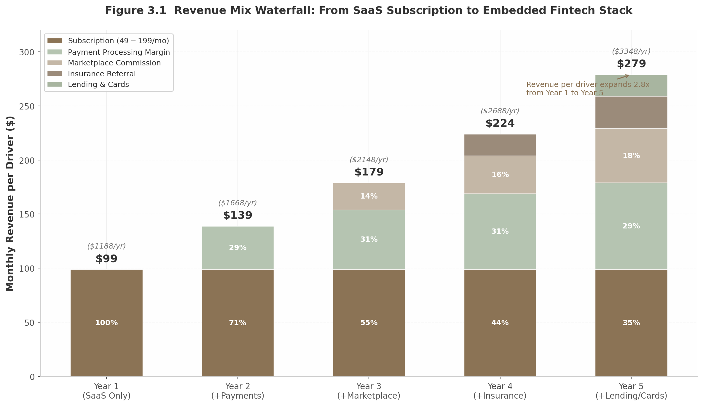

## 3. Business Model & Unit Economics

The most consequential strategic decision DriverLink faces is not product feature prioritization or city selection—it is the sequencing of revenue layer activation. Vertical SaaS platforms that follow the proven playbook of "software first, fintech second, marketplace third" have demonstrated revenue expansion of 2x to 5x per customer compared to pure subscription models [^741^]. Andreessen Horowitz research confirms that adding embedded fintech features to vertical SaaS increases revenue per customer by 2x to 5x, while the embedded finance market overall represents a $185 billion opportunity of which less than 20% has been addressed [^742^]. The question for DriverLink is not whether to layer in payments, lending, and insurance, but how quickly the platform can execute each layer without compromising the standalone SaaS value proposition that drives initial adoption.

### 3.1 Revenue Architecture

#### 3.1.1 Subscription Tiers: The SaaS Wedge

DriverLink's subscription pricing is intentionally positioned at a premium to beauty-and-wellness comparables but below legacy transportation management systems, reflecting the higher earnings potential of professional chauffeurs relative to salon professionals and the superior workflow integration relative to incumbent dispatch software. The three-tier structure—Starter at $49 per month, Professional at $99 per month, and Business at $199 per month—maps directly to the proven architectures of GlossGenius ($24/$48/$148 per month), Toast ($0/$69 per month with processing spread trade-offs), and Shopify ($39/$105/$399 per month) [^676^] [^674^] [^688^].

**Table 3.1  Subscription Tier Benchmarking Across Vertical SaaS Platforms**

| Platform | Tier 1 (Entry) | Tier 2 (Professional) | Tier 3 (Business) | Tier 4 (Enterprise) | Payment Processing |
|----------|---------------|----------------------|-------------------|---------------------|-------------------|
| DriverLink (Proposed) | $49/mo [^140^] | $99/mo | $199/mo | Custom | 2.6% flat |
| GlossGenius | $24/mo [^676^] | $48/mo | $148/mo | $168/mo (medical) | 2.6% flat [^676^] |
| Toast | $0/mo (Starter) [^674^] | $69/mo (POS) | Custom (multi-loc) | — | 2.49% + 15¢ [^674^] |
| Shopify | $39/mo [^688^] | $105/mo | $399/mo | $2,300+/mo (Plus) | 2.4-2.9% + 30¢ [^688^] |
| Limo Anywhere | $89/mo [^140^] | $109-$189/mo | $239+/mo | $1,210-$5,999/mo | +$0.20-0.25/trip [^140^] |
| StyleSeat | $35/mo [^678^] | — | — | — | 1.9-2.6% + 30¢ [^678^] |
| Fresha | Free [^679^] | $19.95/mo | $14.95/staff | — | ~2.29% + fixed [^679^] |

The tier differentiation serves two purposes beyond straightforward revenue segmentation. First, it creates a clear upgrade path that drives net revenue retention: Toast locations that remain on the platform for five years reach an average annual recurring revenue of $16,000, representing a 6x increase from initial spend [^147^]. Second, the entry tier at $49 per month—roughly one hour of billable chauffeur time—minimizes friction for drivers transitioning from manual scheduling systems, while the Business tier at $199 per month captures multi-driver fleets with dispatch coordination and API access needs that Limo Anywhere addresses at 6x to 30x the price point [^140^]. The critical design principle is that every tier must deliver positive return on investment within the first month, measured by time saved on scheduling and invoicing against the subscription fee.

#### 3.1.2 Payment Processing: The Primary Revenue Engine

At maturity, payment processing will represent DriverLink's largest revenue stream—just as it does for Toast (82% of revenue on $51.4 billion in gross payment volume) [^220^] and Shopify (74% of revenue, processing $47.5 billion through Shopify Payments) [^721^]. The platform will charge a flat 2.6% on all transactions, matching GlossGenius's transparent pricing model and undercutting the 2.9% plus 30 cents that Stripe charges for online card-not-present transactions [^685^].

The economics of this layer are compelling. A driver processing $100,000 annually in booking payments at 2.6% generates $2,600 in gross processing fees. DriverLink's cost of funds to its payment processor (Stripe Connect or equivalent) will range from 1.6% to 2.1%, yielding a net spread of 0.5% to 1.0%—or $500 to $1,000 per driver per year in near-pure margin [^741^]. This processing margin alone, at scale, approximately doubles the revenue contribution from subscriptions. BCG and Adyen jointly estimate the total embedded finance revenue opportunity at $185 billion, a 25% increase from their 2022 estimate, with less than 20% of that market currently captured [^742^].

The sequencing of payment activation follows the vertical SaaS playbook precisely: launch with Stripe Connect integration in Year 1, transition to a managed payment facilitator (PayFac) model once annual processing volume exceeds $50 million, and ultimately explore proprietary payment infrastructure at $500 million-plus in gross payment volume. Each transition captures an additional 20 to 50 basis points in margin. ServiceTitan, which processes tens of billions across 9,500 contractor customers, estimates it captures only 50% of its available take rate—meaning the fintech revenue line has room to double without adding a single new customer [^147^].

#### 3.1.3 Marketplace Commission: Demand-Generated Bookings

The marketplace commission layer activates only after the platform achieves sufficient driver density to generate meaningful demand-side liquidity. When a rider discovers and books a driver through DriverLink's marketplace (rather than the driver's own storefront or direct referral), the platform will collect 15% to 20% of the booking value. This is deliberately set below StyleSeat's 30% commission on first-time client bookings (capped at $50) [^678^] and Fresha's 20% commission on new marketplace clients [^679^], reflecting the higher average order values in chauffeur services ($150-$500 per trip versus $60-$150 for salon services) and the lower marginal cost of demand generation in relationship-based premium transport.

The commission structure is designed to avoid the backlash that high marketplace fees generate. StyleSeat's 30% rate has produced significant professional resistance, with service providers actively attempting to move discovered clients off-platform to avoid repeat commissions [^678^]. DriverLink's 15% to 20% rate, applied only to bookings that would not have occurred without platform-mediated discovery, frames the commission as a performance marketing fee rather than a recurring tax on the driver-client relationship. A driver generating just $250 per month in marketplace-origin bookings contributes $37.50 to $50 in monthly commission revenue—incremental to subscription and processing revenue with 85% to 90% gross margin.

#### 3.1.4 Embedded Fintech Expansion: Lending, Insurance, and Cards

The final revenue layer—insurance brokerage, working capital lending, and spend cards—represents the highest-margin, most defensible component of the stack. Insurance commissions for commercial auto and general liability policies range from 15% to 30% of premium [^733^]. Given that commercial livery insurance costs independent drivers $5,000 to $21,600 annually, a single policy referral generates $750 to $6,480 in commission revenue [^733^]. Even at conservative 30% adoption rates and 20% commission structures, insurance referrals add $300 to $1,300 in annual revenue per driver at 70% to 80% gross margin.

Working capital lending follows the Toast Capital model: the platform uses transaction history to underwrite cash advances of $5,000 to $50,000, with automatic repayment deducted from future booking revenue. Toast Capital has disbursed over $5 billion in cumulative merchant funding, generating more than $45 million in annual revenue [^741^]. For DriverLink, vehicle maintenance, insurance premium seasonality, and fleet expansion create natural demand moments for capital access that the platform is uniquely positioned to address through its system-of-record position.

*Figure 3.1 illustrates the phased revenue expansion per driver from Year 1 (subscription-only, $99 per month) through Year 5 (full embedded fintech stack, $279 per month). Subscription revenue's share of total declines from 100% to 35%, while payment processing grows to become the largest single contributor at 29% of the stack. The 2.8x revenue expansion per driver—from $1,188 to $3,348 annually—validates the vertical SaaS land-and-expand playbook in the chauffeur vertical.*

### 3.2 Unit Economics

#### 3.2.1 Driver Acquisition Cost and Lifetime Value

DriverLink targets a blended customer acquisition cost of $300 to $600 per driver, achievable through a product-led growth motion supplemented by driver-to-driver referrals with $100 to $200 bounty incentives and organic content marketing targeting disillusioned Uber Black and Lyft Lux drivers. This CAC range sits comfortably within the $200 to $700 benchmark for SMB vertical SaaS acquired through self-serve and low-touch sales channels [^751^]. For context, the average B2B SaaS CAC across all segments is approximately $702, with fintech SMB CAC reaching $1,450 and e-commerce SMB CAC as low as $274 [^753^].

The lifetime value calculation rests on three variables: average revenue per driver per month, blended gross margin, and monthly churn rate. Under the base case scenario—a driver on the Professional tier ($99 per month) generating $50 per month in payment processing margin and $20 per month in marketplace commission, at 65% blended gross margin and 3.5% monthly churn—the resulting LTV is approximately $3,179. Against a $500 CAC, this produces an LTV:CAC ratio of 6.4:1, well above the 3:1 threshold that growth-stage investors require and competitive with best-in-class vertical SaaS performance [^73^].

**Table 3.2  Unit Economics Scenarios and Vertical SaaS Benchmarks**

| Metric | Conservative | Base Case | Optimistic | Industry Benchmark | Source |
|--------|-------------|-----------|------------|-------------------|--------|
| Monthly ARPU (subscription) | $75 | $99 | $125 | $24-$399 (vertical SaaS range) | [^676^] [^688^] |
| Monthly processing margin | $30 | $50 | $80 | $40-$100 (Toast equivalent) | [^220^] |
| Monthly marketplace revenue | $10 | $20 | $40 | $15-$50 (StyleSeat/Fresha) | [^678^] [^679^] |
| **Total monthly revenue/driver** | **$115** | **$169** | **$245** | — | Calculated |
| Blended gross margin | 55% | 65% | 70% | 60-70% (vertical SaaS + processing) | [^730^] |
| Monthly gross profit/driver | $63 | $110 | $172 | — | Calculated |
| Monthly churn | 5.0% | 3.5% | 2.0% | 3-7% (SMB SaaS) | [^712^] |
| Average lifetime (months) | 20 | 29 | 50 | 24-48 months | [^73^] |
| **Lifetime value (LTV)** | **$1,260** | **$3,179** | **$8,575** | $15K-$40K (SMB SaaS) | [^73^] |
| **Blended CAC** | **$600** | **$500** | **$400** | $200-$700 (SMB PLG) | [^751^] |
| **LTV:CAC ratio** | **2.1:1** | **6.4:1** | **21.4:1** | 3:1+ target | [^73^] |
| **CAC payback period** | **9.5 months** | **4.5 months** | **2.3 months** | <12 months (top quartile) | [^687^] |

The 4.5-month payback period in the base case falls well within the top-quartile SaaS benchmark of under 12 months [^687^] and approaches the sub-6-month performance that product-led growth companies achieve at scale [^684^]. The conservative scenario's 9.5-month payback remains acceptable for seed-stage operations, while the optimistic scenario's 2.3 months—driven by high embedded fintech adoption and low churn—would support aggressive self-funded growth without excessive equity dilution.

#### 3.2.2 Churn Dynamics and Net Revenue Retention

Monthly churn for DriverLink is projected at 3% to 4% in the early stage, declining to 2% to 2.5% as embedded financial services deepen the platform's integration into the driver's business operations. This trajectory outperforms typical SMB SaaS churn of 3% to 7% per month [^712^] for two structural reasons. First, professional chauffeurs represent a fundamentally different cohort from general gig economy workers: they have made career investments in commercial vehicles ($40,000 to $100,000), licensing, and insurance, creating significantly higher switching costs than a part-time rideshare driver. Second, BCG and Adyen research demonstrates that embedded payment strategies retain customers at 2.5x the rate of traditional service providers [^147^]—once a driver's payment processing, CRM, customer booking history, and capital advances all flow through a single platform, migration becomes operationally prohibitive.

Net revenue retention (NRR) is targeted at 105% to 115%, reflecting revenue expansion from tier upgrades, add-on adoption, and increased payment processing volume as drivers grow their businesses. This range aligns with the median private B2B SaaS NRR of 101% to 102% [^689^] and the public SaaS median of 108% to 110%. Companies with NRR at or above 100% grow at 48% year-over-year—twice as fast as those below 100% [^722^]. The NRR floor of 105% assumes that tier upgrades and processing volume growth from existing drivers offset any subscription downgrades or churn, while the ceiling of 115% reflects full adoption of embedded insurance and lending products by the existing driver base.

#### 3.2.3 Annual Recurring Revenue per Driver

At steady state, ARR per driver is projected to range from $2,208 in the base case (Professional tier with moderate processing and marketplace activity) to $4,848 in the upside case (Business tier with full embedded fintech adoption). The conservative case—Starter tier drivers with minimal transaction activity—yields approximately $1,380 in ARR. This range is validated by comparable vertical SaaS platforms: Toast reports ARPU of approximately $39,000 per location per year (including payments) and $6,000 in pure SaaS ARPU [^147^], while GlossGenius at $100 million ARR with an estimated user base in the tens of thousands implies ARPU in the $1,000 to $3,000 range.

The ARR expansion curve is non-linear. Year 1 drivers contribute subscription revenue only. By Year 3, drivers who upgraded tiers and adopted marketplace features generate 1.7x their initial ARR. By Year 5, with insurance and lending layered in, the same cohort produces 2.35x its original revenue—a trajectory directly modeled on Toast's documented 6x ARR expansion over five years [^147^]. This expansion dynamic means that DriverLink's aggregate ARR growth will increasingly be driven by existing driver monetization rather than new driver acquisition, reducing the capital intensity of growth as the platform matures.

### 3.3 Path to Profitability

#### 3.3.1 Gross Margins and Payback Dynamics

DriverLink's blended gross margin is projected at 55% to 70%, reflecting the weighted composition of revenue streams. Pure subscription software carries 80% to 85% gross margins (hosting, payment processor API costs, and tier-1 support), while payment processing nets 40% to 50% after interchange fees and processor costs. Marketplace commissions and insurance referrals operate at 85% to 90% and 70% to 80% respectively, representing near-pure margin with minimal incremental delivery cost [^730^].

**Table 3.3  Revenue Projections and Profitability Milestones by Scale**

| Metric | 1,000 Drivers | 5,000 Drivers | 10,000 Drivers | 25,000 Drivers |
|--------|--------------|---------------|----------------|----------------|
| **Revenue range (ARR)** | $2.2M-$4.9M | $11M-$24M | $22M-$49M | $55M-$121M |
| Subscription revenue | $0.6M-$1.2M | $3.0M-$6.0M | $6.0M-$12.0M | $15.0M-$30.0M |
| Payment processing margin | $0.5M-$1.0M | $2.4M-$4.8M | $4.8M-$9.6M | $12.0M-$24.0M |
| Marketplace commission | $0.3M-$0.6M | $1.5M-$3.0M | $3.0M-$6.0M | $7.5M-$15.0M |
| Embedded fintech | $0.2M-$0.4M | $1.2M-$2.5M | $2.4M-$5.0M | $6.0M-$12.5M |
| Blended gross margin | 55-60% | 58-65% | 60-65% | 62-68% |
| Gross profit | $1.2M-$2.9M | $6.4M-$15.6M | $13.2M-$31.9M | $34.1M-$82.3M |
| Est. operating expenses | $1.5M-$2.5M | $4.0M-$8.0M | $8.0M-$15.0M | $15.0M-$30.0M |
| **Operating income** | **$(0.3)M-$0.4M** | **$2.4M-$7.6M** | **$5.2M-$16.9M** | **$19.1M-$52.3M** |
| **Operating margin** | **(10%)-8%** | **22-32%** | **24-34%** | **35-43%** |
| Months to milestone | 0 (base) | 24-30 | 36-42 | 54-66 |

The path to profitability is delineated by two inflection points. The first occurs at approximately 2,500 to 3,500 active drivers, where gross profit from the installed base covers fixed operating expenses (engineering, support, marketing, G&A). At this threshold—projected at 24 to 30 months from launch in the base case—the business transitions from cash-burning to self-sustaining. The second inflection point occurs at 10,000 drivers, where operating margins compress toward 25% to 30% and the Rule of 40 (growth rate plus profit margin) becomes achievable. Only 11% to 30% of SaaS companies achieve Rule of 40 compliance, but those that do command median revenue multiples of 9.4x versus 3.5x for companies scoring below 20% [^722^].

The margin profile improves with scale for three reasons. First, payment processing spread widens as the platform transitions from Stripe Connect (where Stripe captures the majority of interchange) to managed PayFac (where DriverLink captures an additional 20 to 50 basis points). Second, insurance and lending referral economics improve with portfolio size as partner financial institutions offer volume-based commission accelerators. Third, customer support cost per driver declines as self-service documentation, community forums, and AI-assisted support handle an increasing share of inquiries.

#### 3.3.2 Investor Benchmarks: ARR Growth, Rule of 40, and Valuation

Growth-stage investors evaluate vertical SaaS on a consistent framework of milestones. At Series A, the expectation starts at $1 million to $3 million in ARR with 100% year-over-year growth or higher [^727^]. KeyBanc Capital Markets' 2024 SaaS Survey found median private SaaS growth at 19% to 21%, with the top quartile achieving 27% to 32% [^722^]. DriverLink's target of 100%+ year-over-year growth through Year 3, supported by both new driver acquisition and ARPU expansion, positions the company in the top decile of SaaS growth performance.

The "T2D3" framework—triple, triple, double, double, double in consecutive years—remains the aspirational benchmark for venture-backed SaaS [^727^]. For DriverLink, this would mean growing from $500K ARR at Month 12 to $1.5M (3x) at Month 24, to $4.5M (3x) at Month 36, to $9M (2x) at Month 48, to $18M (2x) at Month 60, to $36M (2x) at Month 72. Achieving this trajectory would require maintaining 8% to 12% month-over-month growth in driver count through Year 2, then transitioning to ARPU-led growth as driver acquisition naturally decelerates.

Valuation multiples for vertical SaaS currently stand at approximately 5.5x ARR for median performers, with Rule of 40 achievers commanding 9x to 10x and top-quartile NRR companies (120%+) earning premiums beyond that [^73^]. At 10,000 drivers generating $35 million in ARR at the midpoint of projections, a 6x to 8x multiple implies an enterprise value of $210 million to $280 million—a 10x to 15x return on a typical $15 million to $20 million Series A+B capital raise. The CloudTrucks precedent—$141.6 million raised at an $850 million valuation for a trucking vertical SaaS platform—validates that transportation vertical SaaS can command premium multiples when unit economics and growth rates meet investor thresholds.

#### 3.3.3 Scale Projections: From 1,000 to 25,000 Drivers

The revenue model scales proportionally with driver adoption but non-linearly in profitability. At 1,000 active drivers—achievable within 18 months in the base case with launches in three Sun Belt cities—DriverLink generates $2.2 million to $4.9 million in ARR. At this scale, the company is approximately breakeven to slightly profitable, with operating expenses of $1.5 million to $2.5 million covering engineering (6-8 headcount), customer success (2-3 headcount), marketing, and G&A.

At 10,000 drivers—projected at 36 to 42 months—ARR reaches $22 million to $49 million with operating margins of 24% to 34%. This represents a genuine scaled business with $5.2 million to $16.9 million in operating income, sufficient to fund organic expansion into new markets and embedded fintech product development without additional equity financing. The 10,000-driver threshold captures approximately 25% to 40% of the estimated 25,000 to 40,000 independent chauffeurs and small fleet operators in the United States—a market penetration rate that is aggressive but achievable given the absence of a dominant incumbent vertical SaaS platform.

At 25,000 drivers—representing majority share of the core TAM—ARR reaches $55 million to $121 million with operating margins of 35% to 43%. At this scale, DriverLink approaches the public-company revenue threshold and becomes an attractive acquisition target for platforms seeking vertical expansion (Shopify, Toast, Square) or a candidate for an initial public offering. The $19 million to $52 million in operating income at this scale supports a $300 million to $800 million enterprise valuation at prevailing SaaS multiples.

The projections embed several conservative assumptions. First, they assume average driver ARPU at the base case level ($2,208 per year) rather than the upside case ($4,848 per year), meaning that successful embedded fintech adoption would drive results toward the upper bound of each range. Second, they assume no revenue from B2B2C corporate travel integrations—which represent a distinct, unmodeled revenue stream from enterprise licensing to travel management platforms. Third, they assume only US market penetration; the EU Platform Work Directive's effective date of December 2026 creates a parallel international expansion opportunity that could double the addressable driver base.

The core economic insight is that DriverLink does not need to achieve Uber-scale network effects to generate venture-scale returns. A 10,000-driver platform with strong unit economics—6.4:1 LTV:CAC, 4.5-month payback, 110% NRR, and 30% operating margins at scale—produces financial outcomes that exceed most vertical SaaS benchmarks. The "SaaS-first, fintech-second, marketplace-third" sequencing ensures that each revenue layer is activated only when the platform has sufficient density to support it, preventing the premature capital consumption that has undermined so many marketplace-first transportation startups.
