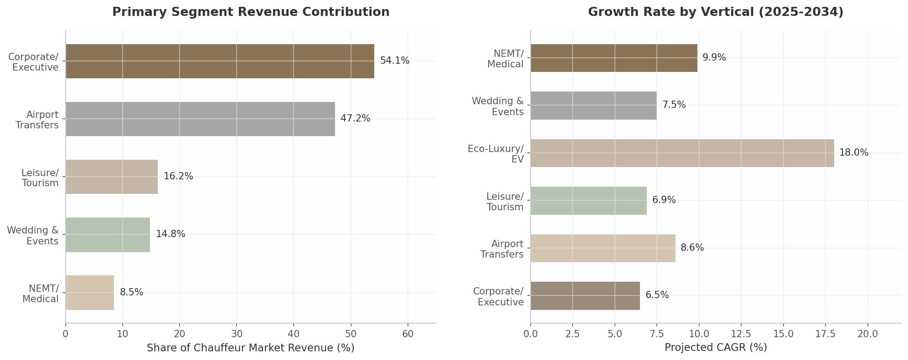

## 4. Target Customer Segments & Vertical Opportunities

### 4.1 Primary Segments

The global chauffeur services market, valued at $52.4 billion in 2025, is not a monolith. Revenue and demand cluster sharply around three principal segments — corporate travel, airport transfers, and leisure tourism — each with distinct pricing dynamics, booking patterns, and technology requirements. Understanding the relative weight and interplay of these segments is essential for any platform seeking to serve independent drivers, because the highest-revenue verticals are not always the highest-growth ones, and the barriers that protect incumbents in one segment may be absent in another.

**Figure 4.1:** Revenue contribution by primary segment (left) and projected CAGR by vertical (right). Corporate travel dominates current revenue but eco-luxury/EV leads in growth trajectory. *Sources: Dimension Market Research, Dataintelo, The Insight Partners, GBTA.*

#### 4.1.1 Corporate/Executive Travel: 49–58% of Market Revenue, $75–$200/hour

Corporate and executive travel is the revenue backbone of the professional chauffeur industry. By one measure, corporate clients commanded 54.1% of global chauffeur car market revenue in 2025–2026.[^1^] An alternative industry analysis places the business segment share at 58.4%, translating to roughly $30.6 billion in annual global revenue.[^1^] Either estimate confirms the same strategic reality: the corporate account is the single most valuable customer relationship an independent chauffeur can hold.

The spending power of this segment is grounded in genuine business need rather than discretionary luxury. Global business travel spending reached a record $1.47 trillion in 2024 and is projected to hit $1.57 trillion in 2025, with ground transportation representing roughly 11.5% of total travel expenditure.[^314^] The average business trip now costs $1,128 per person, up from $834 in 2024, and ground transport consistently ranks among the top three expense categories.[^335^] Typical corporate ground transportation budgets range from $8 million to $45 million depending on company size, with travel accounting for approximately 35% of total T&E spend.[^388^]

What makes corporate clients particularly attractive to independent operators is not just volume but predictability. Corporate accounts generate recurring revenue through annual contracts and travel management company (TMC) integrations.[^1^] A single corporate account with net-30 billing terms can produce more stable cash flow than dozens of one-off retail bookings. Companies typically require $5,000 or more in monthly volume to qualify for preferred vendor status, which unlocks consolidated monthly invoicing that reduces accounts payable processing time by an estimated 4.2 hours per month.[^854^]

The purchasing criteria of corporate travel managers also favor professional chauffeurs over rideshare alternatives. In a 2024 GBTA/NLA survey of 121 U.S. and Canada-based travel managers, 73% identified traveler safety as their single greatest priority for managed ground transportation programs, with an additional 19% ranking it second — making safety the overwhelming priority over cost.[^339^] This safety-first posture translates into policy: 93% of surveyed companies permit chauffeured transportation in high-risk or developing countries, 90% for employees with accessibility needs, 82% for client or customer transport, and 62% for recruiting.[^339^] Duty-of-care obligations are driving a measurable shift from rideshare to professional chauffeur services among Fortune 500 clients.[^380^]

Pricing in the corporate segment reflects these service expectations. Average hourly rates range from $75–$150 for luxury sedan service, $90–$200 for SUV chauffeur service, and $150 or more per hour for executive or VIP chauffeur service.[^335^] Post-COVID recovery trends support continued investment: 81% of business travelers say they traveled the same or more in 2024 versus 2019, and 86% believe business travel is worthwhile in achieving business objectives.[^320^] Notably, 8% of travel managers reported that premium-class policies became more liberal in 2025 — double the prior year and the highest share since before the pandemic.[^388^]

#### 4.1.2 Airport Transfers: 47% of Service Type, $8 Billion U.S. Segment

Airport transfers represent the largest service type by volume, capturing 47.2% of global chauffeur car market revenue by service category.[^1^] The U.S. airport transfer segment alone was valued at $8.0 billion in 2024, driven by the five busiest gateways — Atlanta (ATL), Dallas-Fort Worth (DFW), Chicago O'Hare (ORD), Los Angeles (LAX), and New York JFK — which lead domestic volume.[^412^] Looking ahead, the global airport transportation service market is projected to expand from $29.9 billion in 2025 to $62.8 billion by 2034 at an 8.6% CAGR, while the pre-book airport transfer segment is growing at an even faster 16.4% historical CAGR.[^299^][^300^]

The airport vertical is distinguished by its operational predictability and relatively low seasonality compared to events or leisure tourism. Flight schedules generate demand waves that are knowable days or weeks in advance, and corporate airport transfers — typically priced at $130 flat fare at major metro airports — form a recurring revenue base.[^412^] The technical requirements for competing in this segment, however, are non-trivial. Real-time flight tracking through FAA, SITA, and airline APIs is now table stakes for premium operators.[^818^] Professional services monitor flights from departure through landing, including gate changes and diversions, and automatically adjust chauffeur arrival to actual landing time.[^851^] Blacklane's proprietary dispatch system uses automated flight tracking and buffer-time management to reduce cancellations and improve utilization, a technology capability that independent operators must replicate to compete.[^343^]

Premium meet-and-greet services push per-trip revenue higher. Curbside or gate pickup with porter assistance, 30–60 minutes of complimentary wait time, and professional signage are standard at the luxury tier.[^869^] VIP concierge services range from $475 at Seattle-Tacoma to $1,620 for the LAX Salon experience and $5,235 for the Heathrow Private Suite.[^869^] These premium tiers demonstrate that even within the commoditized airport transfer category, significant pricing power exists for operators who bundle hospitality services.

#### 4.1.3 Leisure/Tourism: Fastest-Growing at 6.9% CAGR

The leisure and tourism segment accounts for 16.2% of global limousine service revenue and is the fastest-growing application segment at 6.9% CAGR, fueled by rising disposable incomes and a post-pandemic preference for experiential travel.[^316^] The broader luxury travel market provides context for this growth: luxury travelers account for approximately 36% of global travel spending, with market estimates for 2024 ranging from $1.48 trillion to $2.51 trillion depending on definitional scope.[^406^]

Within the chauffeur segment, city tours and hourly charter demand represent the highest-margin service type because the meter runs on time rather than distance. Blacklane's revenue mix illustrates this dynamic: city-to-city long-distance rides contribute approximately 30% of revenue, hourly bookings 25%, and airport transfers 45%.[^343^] Hourly and as-directed services carry the highest per-trip revenue potential precisely because they are uncapped by distance or duration.[^343^]

Hotel concierge partnerships serve as a key distribution channel for leisure bookings. Over 500 luxury hotels in the United States integrated premium limousine services with digital booking platforms in 2025, improving guest transfer efficiency by an estimated 18%.[^387^] These partnerships typically include airport pickups, hotel-to-event transfers, private city tours, and hourly as-directed service — creating bundled revenue opportunities that span multiple service types in a single guest stay.

**Table 4.1: Primary Customer Segment Comparison Matrix**

| Dimension | Corporate/Executive | Airport Transfers | Leisure/Tourism |
|---|---|---|---|
| Revenue Share | 54.1% of chauffeur market [^1^] | 47.2% of service type [^1^] | 16.2% of service revenue [^316^] |
| Pricing Benchmark | $75–$200/hour [^335^] | $75–$250/trip [^412^] | $100–$500/hour [^343^] |
| Growth Rate | 6.0–6.5% CAGR [^314^] | 8.6% CAGR [^300^] | 6.9% CAGR [^316^] |
| Key Purchasing Factor | Safety (73% of travel managers) [^339^] | Flight tracking reliability [^851^] | Experience quality [^406^] |
| Booking Channel | TMCs, corporate portals [^298^] | Direct, travel agents [^299^] | Hotel concierges, OTAs [^387^] |
| Seasonality | Low | Low | Moderate |
| Entry Barrier | High (TMC relationships) | Medium (flight tracking tech) | Medium (concierge networks) |

This comparison reveals a strategic tension worth noting. Corporate travel offers the highest revenue share and lowest seasonality but requires navigation of TMC gatekeeper relationships and corporate credentialing programs. Airport transfers provide the most predictable demand but demand significant technology investment in flight tracking and dispatch automation. Leisure tourism delivers the strongest growth trajectory and highest per-hour margins but suffers from moderate seasonality and dependence on hospitality industry relationships. A platform serving independent drivers must account for these trade-offs when prioritizing which segment to address first — and the evidence strongly favors corporate as the initial beachhead, with airport and leisure as follow-on expansions.

### 4.2 High-Growth Verticals

Beyond the three primary revenue segments, several specialized verticals exhibit characteristics that make them disproportionately attractive for independent operators: structural demand growth, incumbent weakness, regulatory tailwinds, or some combination of all three. NEMT, wedding and events, and eco-luxury/EV services each present distinct risk-reward profiles that warrant dedicated analysis.

**Table 4.2: High-Growth Vertical Opportunity Matrix**

| Dimension | NEMT | Wedding & Events | Eco-Luxury/EV |
|---|---|---|---|
| U.S. Market Size | $4.4–6.6B [^134^] | $750–$1,075 avg. per event [^355^] | 18% fleet penetration (2025) [^103^] |
| Projected CAGR | 7–10% (9.9% through 2034) [^795^] | 7.5% [^316^] | 18%+ (fleet share to 42% by 2030) [^103^] |
| Key Demand Driver | 61.2M Americans aged 65+ [^397^]; 3.6M missed appointments [^134^] | $300B global wedding market [^316^]; 28% YoY weekend event growth [^387^] | Corporate ESG mandates; ULEZ/congestion pricing [^824^] |
| Incumbent Weakness | ModivCare bankruptcy (Aug 2025); 64% driver turnover [^885^][^134^] | Fragmented local operators; no national platform [^316^] | Blacklane acquired by Uber (Mar 2026) [^343^] |
| Entry Barrier | High (broker credentialing, ADA vehicles, PASS cert.) | Low-Medium (insurance, vehicle, venue relationships) | Medium (EV capital cost $40K–$90K) |
| Margin Potential | 12–18% (Medicaid); 40–50% (private pay) | 30–50% premium over standard rates | 10–20% green premium; 50–70% lower fuel costs |
| Revenue Stability | High (recurring dialysis: 156 trips/patient/year) | Seasonal (70%+ in May–October) | High (corporate accounts mandate EV options) |

#### 4.2.1 NEMT: $4.4–$6.6 Billion U.S. Market, 7–10% CAGR, ModivCare Bankruptcy Creates Opportunity

Non-Emergency Medical Transportation (NEMT) represents the most structurally compelling vertical for independent operators willing to navigate its regulatory complexity. The U.S. NEMT market is estimated at $4.4–$6.6 billion, accounting for 41–45% of global revenue in a market valued between $10.76 billion and $16.71 billion.[^134^] Growth is projected at 9.9% CAGR through 2034, with the global market expected to reach $34.5 billion.[^795^] This growth is not speculative — it is anchored in demographic inevitability. In 2024, 61.2 million Americans were aged 65 or older (18.0% of the population), a figure projected to exceed 80 million by 2040.[^397^] The average American outlives their ability to drive safely by 7–10 years, and 7.7 million Americans aged 65+ currently have travel-limiting disabilities.[^415^]

The demand signal is stark: 3.6 million Americans miss medical appointments annually due to lack of transportation, costing the healthcare system $150 billion in missed appointments, delayed treatments, and preventable emergency room visits.[^134^] Dialysis patients alone generate 156 predictable trips per year, creating a recurring revenue stream that is unusual in transportation.[^134^] Medicaid is the primary payer, accounting for approximately 52% of all NEMT payments, with ambulatory trip reimbursement averaging $25–$45 nationally and wheelchair trips $45–$70.[^332^] The most significant growth vector, however, is Medicare Advantage: NEMT coverage in standard MA plans expanded from approximately 15% in 2020 to 36% in 2025, with reimbursement rates 20–50% above Medicaid.[^134^]

The ModivCare bankruptcy in August 2025 — the largest NEMT broker in the United States filing Chapter 11 and emerging in December 2025 with $1.4 billion in debt reduced to $300 million — has created a supply vacuum that independent operators are well-positioned to fill.[^885^] ModivCare coordinated approximately 36.8 million transportation trips annually across 48 states, yet the company generated only $161.1 million in adjusted EBITDA on $2.79 billion in service revenue (a 5.8% margin), ending 2024 with a $201.3 million net loss.[^885^] The industry's structural pressures — driver shortages exceeding 64% annual turnover, stagnant Medicaid reimbursement rates, and rising labor costs — have made the large broker model economically precarious.[^134^]

Independent operators who invest in the necessary certifications — PASS (Passenger Assistance, Safety and Sensitivity), CPR/First Aid, ADA compliance, and HIPAA training — can access broker-managed demand (brokers control roughly 70% of Medicaid NEMT trips) while maintaining lower overhead than the legacy broker-dependent networks.[^776^][^777^] Payment terms vary significantly: Veyo pays weekly via EFT, ModivCare in 15–30 days, MTM in 30–45 days, and Access2Care in 45–60 days.[^773^] Technology-enabled providers experience meaningful operational advantages: NEMT providers using broker-integrated software report 40% faster claim processing, 65% fewer billing errors, and 30% higher contract retention rates.[^779^]

#### 4.2.2 Wedding & Events: $750–$1,075 Average, 20–40% Seasonal Premium

The wedding and events vertical offers the highest margins of any segment for appropriately positioned operators. Wedding services constitute approximately 14.8% of total limousine service revenue, with the global wedding market estimated at $300 billion in 2025 and U.S. weddings averaging $35,000 in expenditure.[^316^] According to The Knot's 2024 Real Weddings Study of nearly 17,000 couples, the average wedding transportation cost is $750–$1,075 nationwide, with significant regional variation: $1,200–$1,400 in the Northeast, $1,100–$1,300 on the West Coast, $800–$1,000 in the Midwest, and $750–$950 in the South.[^355^]

The economics of wedding service are substantially more favorable than standard hourly work. Peak wedding season (May through October) commands a 20–40% pricing premium, with September and October as the most popular months.[^821^] Off-season months (January through March) offer 15–25% lower pricing, creating an opportunity for operators to fill capacity during slow periods.[^822^] The pricing hierarchy by vehicle type is steep: standard stretch limousines at $100–$250 per hour, SUV limos at $150–$300 per hour, and luxury vehicles such as Rolls Royce at $250–$500+ per hour, with most operators requiring 3–5 hour minimums.[^355^]

Wedding bookings are also structurally complex, creating natural bundling opportunities. Larger weddings require multi-vehicle coordination — bridal party transportation, guest shuttles, airport transfers for out-of-town guests, and grand exit vehicles — all managed through a single point of contact.[^837^] Multi-vehicle bookings should be secured 8–12 months in advance for peak dates, creating predictable forward revenue.[^822^] Professional operators who achieve "preferred vendor" status at 5–10 high-volume venues can generate $100,000–$300,000 in concentrated seasonal revenue with a single executive Sprinter or stretch SUV.

The competitive landscape is favorable. Unlike corporate travel (dominated by TMCs) or NEMT (dominated by Medicaid brokers), the wedding transportation market remains highly fragmented with no national platform and most competition coming from localized operators who rely on word-of-mouth and venue relationships rather than technology. The entry barrier is relatively modest: commercial insurance, an appropriate vehicle (SUV, limo, or Sprinter), professional appearance, and relationship-building with wedding planners and venues.

#### 4.2.3 Eco-Luxury/EV: 18% Fleet Penetration, Fastest-Growing Segment

Eco-luxury chauffeur services represent the highest-growth vertical in the industry, driven by the convergence of corporate ESG mandates, urban emission zone regulations, and the emergence of Tesla and other EVs as credible luxury vehicles. In 2025, approximately 18% of vehicles in the global luxury and executive chauffeured fleet were either fully electric or hybrid, a figure projected to rise to 42% by 2030.[^103^] Electric vehicle use in ride-hailing rose 45% between 2022 and 2025, with approximately 500,000 EVs operating under ride-hailing fleets globally by 2025.[^826^]

Blacklane's trajectory validates the green premium thesis. The company became the first global ride service to offset carbon emissions for all rides in 2017, pledged net-zero by 2030, and launched an all-electric Mercedes-Benz EQS fleet in Dubai.[^824^] By early 2026, Blacklane had achieved record annual revenue exceeding EUR 300 million, demonstrating that carbon-neutral positioning is compatible with — and may even enhance — premium pricing.[^828^] The company's "Limo-Green" initiative targeting 50% EV fleet penetration by 2025 established a benchmark that competitors are now scrambling to meet.[^828^]

Regulatory tailwinds are accelerating adoption. Urban congestion pricing in New York and Ultra Low Emission Zones (ULEZ) in London create direct economic incentives for zero-emission vehicles.[^343^] Corporate clients with ESG commitments are increasingly mandating that travel suppliers demonstrate measurable carbon emission reductions, directly influencing fleet composition decisions at chauffeur service operators of all sizes.[^103^] For independent operators, the economics are favorable: lower fuel and maintenance costs (50–70% per mile reduction) plus a 10–20% "green" pricing premium, offset by the upfront capital cost of a Tesla Model Y/S/X ($40,000–$90,000) and charging infrastructure challenges.[^807^] The main operational constraint is charging infrastructure for high-mileage daily operations, with over 90% of fleet operators reporting that grid limitations slow growth and public charging stations experiencing approximately 21% failure rates.[^807^][^817^]

### 4.3 Vertical Stacking Strategy

#### 4.3.1 Same Driver, Multiple Verticals = 60–70% Utilization

The most sophisticated independent operators do not specialize in a single vertical — they stack them. The same driver with a single executive-class SUV can execute airport transfers Monday through Thursday morning, NEMT dialysis runs on Friday mornings, a wedding on Saturday afternoon, and a leisure city-tour booking on Sunday. This vertical stacking model is the key to achieving 60–70% utilization rates, compared to roughly 40% for operators who focus exclusively on airport transfers or any single vertical.

The economics of stacking are compelling. Airport transfers provide the demand foundation — 47.2% of service type volume with predictable daily flight schedules.[^1^] NEMT adds recurring, government-backed demand: a single dialysis patient generates 156 trips per year on a fixed schedule.[^134^] Wedding and event services inject high-margin revenue during peak season, with 30–50% pricing premiums over standard hourly rates.[^355^] Eco-luxury certification opens access to corporate accounts with ESG mandates that are growing fastest among enterprise travel programs.[^103^]

The primary obstacle to vertical stacking is operational complexity. Each vertical imposes distinct requirements: flight tracking APIs for airport work, PASS certification and Medicaid broker integrations for NEMT, venue relationships and multi-vehicle coordination for weddings, and EV charging management for eco-luxury.[^851^][^776^][^837^][^807^] An independent driver attempting to manage these requirements across five different software tools — one for scheduling, another for invoicing, a third for CRM, a fourth for flight tracking, and a fifth for Medicaid billing — faces prohibitive administrative overhead. This complexity is precisely why a unified vertical SaaS platform creates value: by consolidating service templates, certification tracking, and booking management into a single interface, the platform enables stacking that would otherwise be impractical.

#### 4.3.2 Service Templates as Core Differentiator

The service template model — pre-configured workflows for each vertical that drivers can activate, customize, and deploy — transforms vertical stacking from a theoretical strategy into an operational reality. Rather than building separate products for airport, senior care, wedding, and corporate verticals, a template-based architecture allows a single driver to operate across multiple verticals from one dashboard. The prototype's existing service template system (airport, hourly, VIP black, senior, errand) is architecturally correct for this purpose.

Each template encapsulates the vertical-specific requirements that would otherwise create friction. An airport transfer template includes flight tracking integration, automatic wait-time calculation, meet-and-greet option toggles, and flat-rate pricing by route. An NEMT template includes PASS certification tracking, wheelchair accessibility badges, Medicaid broker API integration, and recurring route scheduling. A wedding template includes multi-vehicle coordination, seasonal pricing multipliers, preferred venue directories, and deposit/contract management. An eco-luxury template includes carbon offset tracking, ESG reporting outputs for corporate clients, and charging station route optimization.

The strategic value of service templates extends beyond convenience. Templates create a form of "soft lock-in" — as drivers build their business around template-configured workflows, add vertical-specific customer data, and accumulate certification records, the switching cost to any competing platform rises non-linearly. A driver running three verticals through integrated templates has effectively made the platform their operating system, not merely their scheduling tool. At scale, the platform that best enables vertical stacking will capture the highest-utilization, highest-revenue operators — the drivers who are most valuable and most difficult for competitors to poach. The data moat deepens with each additional vertical a driver adds: customer preferences, booking histories, payment methods, and certification records across multiple service types create data gravity that compounds over time. In a market where network effects are asymptotic and relationship-based competition predominates, vertical stacking through service templates is not just a product feature — it is the core competitive architecture.
