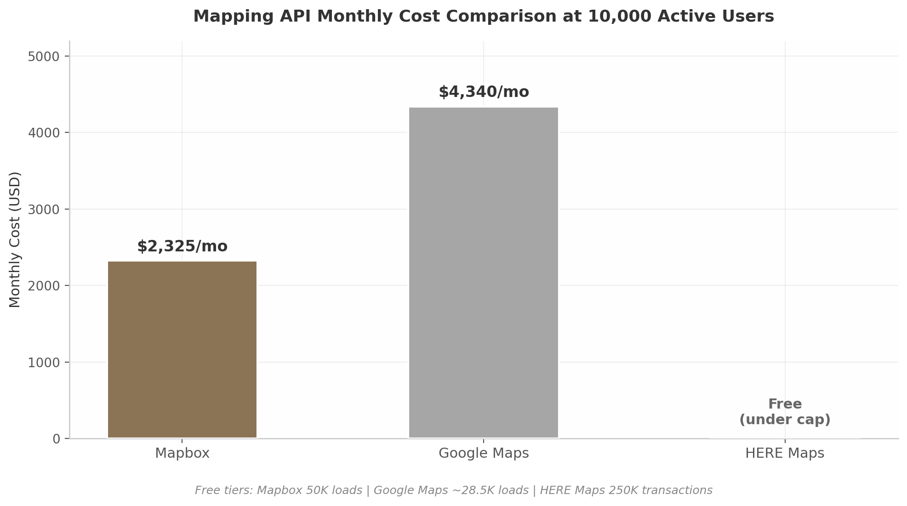
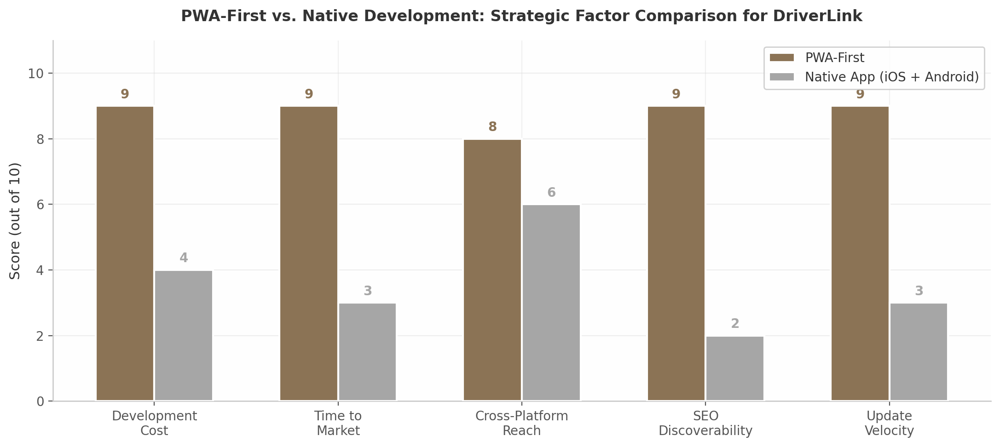

# 5. Product & Technology Architecture

The DriverLink platform must satisfy a dual mandate: it needs to deliver the polish and reliability expected of consumer-grade booking software while remaining architecturally lean enough to support rapid iteration on a startup budget. This chapter translates the market requirements identified in preceding sections into a concrete technical blueprint. It defines the core feature set, recommends a production-ready technology stack, and maps the third-party integration ecosystem required for full operational coverage. Every recommendation is benchmarked against incumbent platforms and grounded in current vendor capabilities and pricing.

## 5.1 Core Platform Features

### 5.1.1 Branded Storefronts: Custom Subdomains, White-Label Booking, SEO

The branded storefront is the platform's signature feature — the visible manifestation of DriverLink's promise to turn every driver into an independent brand. Every incumbent in the space offers white-label booking portals because the ability to present a professional, personalized face to customers directly influences conversion. Limo Anywhere, which serves over 5,400 operators across 60 countries, provides a "Passenger Web App (PWA)" that lets customers "offer their travelers a way to book rides, manage their accounts, and track their in-progress rides with status updates and driver GPS location"[^1^]. The expectation is already set: drivers joining DriverLink will anticipate comparable branding control.

Architecturally, the storefront layer follows the classic multi-tenant SaaS subdomain pattern. Each driver receives a unique slug that resolves to `drivername.driverlink.com`, with optional custom domain mapping to branded URLs such as `book.marcusvanceluxury.com`. Wildcard DNS records pointing to a central load balancer automate provisioning, while SSL certificate management is handled via Let's Encrypt with ACME protocol automation[^2^]. Critically, the storefront pages must be server-side rendered (SSR) to ensure search-engine indexability — each driver's page becomes a discoverable destination for local SEO, targeting queries like "black car service Atlanta" or "senior transport Denver." Brand theming extends beyond logos and color palettes to typography, hero imagery, and configurable page layouts that let drivers in distinct verticals (corporate, family, VIP) emphasize the elements most relevant to their clientele.

### 5.1.2 Service Catalog: Seven Configurable Templates

A driver serving airport executives needs fundamentally different booking fields than one specializing in senior care transit. The service catalog addresses this by providing seven pre-configured templates, each with its own pricing rules, required fields, and availability logic: Airport Transfer, Hourly/As-Directed, Point-to-Point, VIP/Executive, Senior/Medical Transit, Errands/Courier, and Corporate Recurring. This breadth aligns with competitive offerings — Onde's platform alone supports "50+ service types to choose from, including ride-scheduling, multiple drop-offs, API integrations for enabling Calendar Sync or Flight Tracking"[^3^].

Each service template is stored as a JSON schema in the database, allowing drivers to customize pricing (flat rate, hourly, per-mile, or quote-based), vehicle requirements, booking fields (flight numbers for airport pickups, accessibility notes for senior rides, dress code for events), and availability windows. The booking form rendered to riders adapts polymorphically based on the selected service type, presenting only the relevant fields and dynamically calculating price estimates. For premium or complex services, the template supports a "quote required" mode where bookings enter a manual review workflow before confirmation.

### 5.1.3 Booking Management: State Machine, SMS/Email, Quote Management

Booking workflows are inherently transactional — a failure at any stage (payment declined, driver unavailable, customer cancels) must leave the system in a coherent state. A state machine pattern enforces this rigor by modeling "a process as a series of discrete states and transitions" where "each booking state represents a clear stage in the workflow"[^4^]. The recommended status lifecycle runs: Pending Confirmation → Confirmed → Assigned → En Route → Arrived → In Progress → Completed, with cancellation and declination paths at the first two states.

Real-time status visibility is table stakes. DrivOQ's implementation demonstrates the expected standard: "As drivers update their status to en route or on trip in the driver app, their GPS location streams to the dispatch server via WebSocket"[^5^]. DriverLink replicates this pattern, pushing location updates to riders through WebSocket connections and updating ETAs dynamically via Mapbox's Directions API.

Automated notifications drive operational efficiency. Anolla reports that "automated SMS and email reminders notify passengers about departure times, meeting points, terminals or loading window arrivals" and can "reduce no-shows and empty trips by up to 14.9%"[^10^]. The notification system triggers on eight key events: booking confirmation, 24-hour reminder, driver assigned, driver en route, driver arrived, trip completion with receipt, review request (24 hours post-completion), and cancellation confirmation. Twilio handles SMS delivery at roughly $0.0075 per message in the US, while SendGrid manages email templating and delivery.

Quote management supports premium services where fixed pricing is impractical. Book Rides Online's approach provides a reference: clients submit quote requests through the passenger app, and "drivers can accept/decline reservation assignments and record trip logs seamlessly with signatures and geo-location time-stamping"[^7^]. DriverLink's quote flow follows a request → notification → response with price breakdown → customer approval → booking conversion pipeline, with configurable expiration timers to prevent stale quotes from blocking driver availability.

### 5.1.4 Driver CRM: Customer Profiles, History, Preferences — the Data Moat

The customer relationship management module is where DriverLink builds its most defensible long-term asset. While booking tools can be replicated, the accumulated customer data — preferences, histories, behavioral patterns — becomes increasingly valuable with each interaction and progressively harder for a driver to abandon. Square's booking software demonstrates the baseline expectation: it "includes a built-in customer directory that stores client contact details, booking history, notes, and payment information in one place" and allows businesses to "store all your client details — preferences, birthdays, documents, images, and files — with customer profiles"[^6^].

DriverLink's CRM extends this model with features specific to chauffeur services. Customer profiles capture standard contact information alongside rider preferences — preferred vehicle temperature, usual pickup locations, accessibility needs, companion passenger details, and corporate billing relationships. The system surfaces repeat customer identification, frequency analytics, and lifetime value scoring to help drivers prioritize their most valuable relationships. Importantly, the CRM includes corporate account management, enabling multiple passengers to book under a single billing entity — a critical capability for the B2B segment explored in the customer segments chapter.

Table 1 benchmarks DriverLink's planned feature set against five incumbent platforms:

**Table 1: Competitor Platform Feature Comparison**

| Feature | Limo Anywhere | Moovs | Book Rides Online | Anolla | TransferVista | DriverLink (Planned) |
|---|---|---|---|---|---|---|
| Branded storefront | PWA [^1^] | Yes | Yes | Yes | Yes | Custom domain + SEO |
| Airport / flight tracking | Yes | Yes | Yes | Yes | Yes | FlightAware API [^23^] |
| Hourly / as-directed | Yes | Yes | Yes | Yes | Yes | Configurable templates |
| VIP / executive | Yes | Yes | Limited | No | Yes | Premium tier features |
| Senior / medical | Via partner | No | No | No | No | Native template |
| Quote management | Limited | Yes | Yes [^7^] | Yes | Yes | Full quote workflow |
| Customer CRM | Basic | Basic | Basic | Basic | Basic | Profiles + preferences [^6^] |
| SMS / email alerts | Yes | Yes | Yes | Yes [^10^] | Yes | Twilio + SendGrid |
| Real-time GPS tracking | WebSocket [^5^] | Yes | No | Yes | Yes | WebSocket + Mapbox |
| Payment processing | Stripe | Stripe | Stripe | Stripe | Stripe | Stripe Connect [^8^] |
| Multi-tenant SaaS | Yes | Yes | Yes | Yes | Yes | PostgreSQL RLS [^15^] |

The comparison reveals a market fragmented by feature depth rather than breadth. Every competitor covers the core booking workflow, but premium capabilities — senior care templates, sophisticated quote management, deep customer CRM — remain thinly implemented. DriverLink's opportunity lies in matching the baseline while building superior data infrastructure in the CRM layer. The state machine booking engine, flight-tracking integration, and corporate account architecture collectively represent a feature set that positions DriverLink above the mid-market tier without incurring the complexity and cost of legacy enterprise systems.

## 5.2 Technology Stack

### 5.2.1 Recommended Stack: Next.js + Supabase + Stripe Connect + Twilio + Mapbox

The recommended architecture prioritizes development velocity without sacrificing scalability — a balance essential for a startup that must demonstrate traction before Series A. The stack is unified around JavaScript/TypeScript, eliminating context-switching overhead and enabling full-stack engineers to contribute across the codebase.

**Frontend.** Next.js 15 with the App Router is the framework of choice. Server-side rendering is not merely a performance optimization for DriverLink — it is a core product requirement, because each driver's storefront must be fully indexable by search engines to capture organic local traffic. Next.js server components further reduce client-side JavaScript payloads, improving page load times for riders on mobile networks. The UI layer uses Tailwind CSS paired with shadcn/ui, a combination that accelerates development through pre-built, accessible components while preserving full customization control.

**Backend and Database.** Supabase serves as the backend backbone, providing PostgreSQL, authentication, real-time subscriptions, and object storage in a single managed platform. The selection is pragmatic: approximately 55% of Y Combinator companies now use Supabase, indicating strong developer confidence and ecosystem maturity[^12^]. Supabase pairs naturally with Next.js — "the supabase-js client works in both browser and server environments"[^12^] — enabling seamless data fetching across server components, API routes, and client-side interactivity.

PostgreSQL's Row-Level Security (RLS) is the architectural cornerstone for multi-tenancy. RLS "combines the best of both worlds: a single, shared schema for all tenants (easy to deploy and scale) while centralizing the tenant filtering in the database engine"[^15^]. Critically, RLS provides "defense in depth: even if our code has a bug, the database won't return or modify data outside the tenant's scope"[^15^]. Performance is managed through explicit tenant filters in queries, which "allows PostgreSQL to use indexes more effectively" — Supabase benchmarks show a 94.74% improvement from 171 ms to 9 ms when filters are applied explicitly[^16^].

**Payments.** Stripe Connect Express handles marketplace payments, driver onboarding, and compliance. The choice is straightforward: Connect is purpose-built for platforms that need "to manage split payments, vendor onboarding, payouts, and financial compliance"[^8^]. For businesses like DriverLink, "getting payouts quickly and handling fees smoothly is important for keeping workers happy"[^8^]. Stripe Connect Express enables driver onboarding in under two minutes, with Stripe handling KYC verification automatically[^17^]. The platform fee is collected at transaction time, with the remainder routed directly to the driver's Stripe balance — eliminating the operational complexity of managing payouts manually.

**Mapping and Location.** Mapbox is selected over Google Maps primarily on cost grounds. At 10,000 active users, Mapbox's core APIs cost approximately $2,325 per month compared to Google Maps' $4,340 — a 46% savings[^19^]. Mapbox also offers a more generous free tier (50,000 map loads versus Google's approximately 28,500)[^19^]. The primary risk is autocomplete search pricing: Mapbox's Search Box API bills per keystroke if not properly debounced, which can "completely negate" the cost advantage[^19^]. DriverLink mitigates this with a 300 ms debounce on all address autocomplete fields and a fallback to OpenStreetMap via MapLibre for high-volume batch geocoding scenarios.

The cost differential is substantial at scale. For a platform targeting breakeven at the seed stage, the $24,000 annual difference between Mapbox and Google Maps at 10,000 users represents meaningful runway extension.

**Table 2: Recommended Production Technology Stack**

| Layer | Technology | Rationale |
|---|---|---|
| Frontend framework | Next.js 15 (App Router) | SSR for SEO, server components, API routes |
| UI components | Tailwind CSS + shadcn/ui | Fast development, accessible, customizable |
| Mobile delivery | PWA + Capacitor wrapper | Cross-platform, 40-60% cost reduction [^20^] |
| Backend runtime | Node.js via Next.js API | 44% higher requests/sec than Python for I/O workloads [^13^] |
| Database | PostgreSQL (Supabase) | RLS multi-tenancy, real-time subscriptions, auth |
| Authentication | Supabase Auth (GoTrue) | Built-in OAuth, RLS integration, social login |
| Payments | Stripe Connect Express | Marketplace-native, 2-min driver onboarding [^17^] |
| SMS gateway | Twilio | Industry standard, global coverage, ~$0.0075/SMS |
| Email delivery | SendGrid / AWS SES | Template engine, queue-based delivery |
| Mapping | Mapbox | 46% cheaper than Google Maps at scale [^19^] |
| Queue / background jobs | Bull + Redis | Notification scheduling, async processing |
| File storage | Supabase Storage | Vehicle photos, driver documents, CDN delivery |
| Hosting | Vercel + Cloudflare | Edge deployment, auto-scaling, global CDN |
| Monitoring | Sentry + Datadog | Error tracking, performance monitoring |

### 5.2.2 Mobile Strategy: PWA-First (40-60% Cheaper)

DriverLink's mobile strategy prioritizes Progressive Web Apps (PWAs) over native iOS and Android development for both the rider booking experience and the driver companion app. The rationale is economic and operational. PWAs "cost 40-60% less than native development and reach the market 50-70% faster"[^20^], a decisive advantage for a seed-stage company that must validate product-market fit before committing to expensive native codebases. PWAs also update instantly — no app store review cycles — and are inherently discoverable via search engines, aligning with the SEO-driven customer acquisition strategy.

The primary limitation is iOS push notification support. PWAs on iOS "may face limitations in delivering push notifications, potentially affecting user engagement compared to the Android platform"[^21^]. For a booking platform where real-time driver assignment alerts directly impact customer experience, this is a material constraint. The recommended resolution is a phased approach: launch with PWA for both rider and driver experiences, then wrap the PWA in Capacitor to gain native push notification capabilities via Apple's APNS without rewriting the application. A fully native driver app is deferred until continuous background GPS tracking — which PWAs cannot provide — becomes a core requirement.

### 5.2.3 Multi-Tenancy: PostgreSQL RLS

Multi-tenancy is the foundational architectural pattern that enables DriverLink to serve thousands of independent drivers from a single deployed instance. Three patterns exist: database-per-tenant (highest isolation, poorest scalability), schema-per-tenant (moderate isolation, moderate scalability), and shared-table with Row-Level Security (good isolation, best scalability, lowest complexity)[^15^].

DriverLink adopts the shared-table model with PostgreSQL RLS. Every table contains a `tenant_id` column, and RLS policies enforce that queries return only rows belonging to the current tenant. This approach is validated by Supabase's own benchmarks showing 94.74% query performance improvement when explicit tenant filters complement RLS policies[^16^]. For enterprise-scale tenants requiring dedicated resources, a bridge pattern migrates them to isolated schemas without changing application code.

The multi-tenancy architecture extends beyond data isolation to encompass per-tenant configuration. Each driver's branding settings, service templates, pricing rules, notification preferences, and custom domain mapping are stored as JSON columns within the tenant record, enabling deep customization without schema migrations.

## 5.3 Integration Ecosystem

### 5.3.1 FlightAware, QuickBooks, Stripe Connect

Airport transfers represent one of the highest-frequency, highest-value service categories. The FlightAware AeroAPI integration is what elevates DriverLink's airport service from a standard pickup to an intelligent, delay-adaptive experience. AeroAPI is "a simple and cost-effective query-based API that delivers data on demand from millions of flight status inputs" with "over 60 distinct endpoints" including "real-time alerting on flight events that mean the most to you, including departure, arrival, cancels, flight hold detections"[^23^]. The integration pattern stores the passenger's flight number with the booking, polls AeroAPI starting 24 hours before the scheduled pickup, and automatically adjusts the driver's assigned arrival time based on actual flight status. Both driver and passenger receive proactive notifications of delays, eliminating the manual coordination that currently plagues airport transfer services.

QuickBooks integration addresses the back-office accounting burden that consumes disproportionate time for small operators. QuickBooks uses "OAuth 2.0 for app authentication" and "provides endpoints for creating invoices, retrieving clients, and managing payments"[^24^]. DriverLink's integration automatically generates QuickBooks invoices upon trip completion, synchronizes payment records, and maintains customer record alignment — turning what is currently a daily manual bookkeeping task into a fully automated background process.

Stripe Connect, detailed in Section 5.2.1, completes the operational trinity by handling the financial pipeline: rider payment collection, platform fee deduction, driver payout disbursement, and automated tax document generation (1099-K in the US).

### 5.3.2 SAP Concur, Expensify, Amex GBT for B2B2C

The B2B2C channel — where DriverLink serves as the embedded transportation layer within corporate travel programs — requires integration with the dominant expense management and travel booking platforms. SAP Concur, Expensify, and American Express Global Business Travel (Amex GBT) collectively cover the majority of the enterprise travel management market. These integrations enable seamless ride booking within approved corporate travel workflows, automatic expense categorization, and compliance with corporate travel policies.

The integration architecture follows a webhook-and-API pattern. When an executive books a ride through their company's Concur instance, the request flows to DriverLink's API with pre-approved cost center and project codes. Upon trip completion, the receipt and expense details are pushed back to Concur for automated reconciliation. This closed-loop integration removes the friction of manual expense submission — a pain point that drives corporate travel managers to consolidate around platforms that offer native connectivity.

For the driver-side ecosystem, integration opportunities extend to fleet management platforms (GPS tracking hardware, dashcam systems, DOT compliance monitoring), calendar systems (two-way sync with Google Calendar and Microsoft Outlook via their respective APIs)[^18^], and emerging usage-based insurance APIs. The insurance category is less mature — Smartcar provides "a car API" for usage-based insurance but the ecosystem remains fragmented[^25^]. Early-stage partnerships with commercial auto insurers (Progressive Commercial, Geico Commercial) are recommended over direct API integrations until the category matures.

The integration strategy follows a clear prioritization sequence. Phase 1 (launch) includes Stripe Connect, Twilio, SendGrid, and Mapbox — the integrations required for core marketplace operations. Phase 2 (months 3-6) adds FlightAware AeroAPI, QuickBooks sync, and Google Calendar integration. Phase 3 (months 6-12) introduces the B2B2C ecosystem (SAP Concur, Expensify, Amex GBT) and fleet management connectivity. This staged approach prevents integration complexity from overwhelming the core product iteration cycle while building toward the platform's full ecosystem vision.
