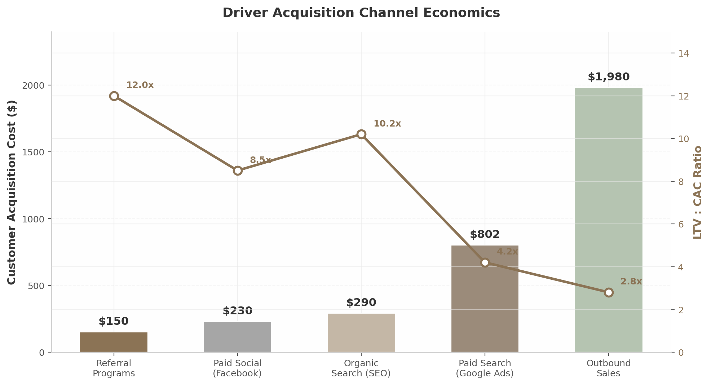
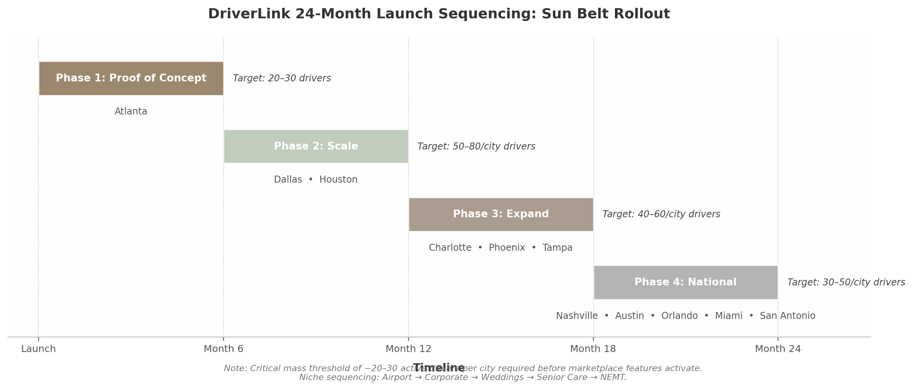

## 6. Go-to-Market Strategy

DriverLink's go-to-market playbook is built on a supply-first sequencing model validated by the launch histories of Uber, OpenTable, and Toast. The core strategic insight is that premium chauffeur services are relationship-based, not algorithm-based — meaning network effects provide less defensibility than in mass ride-hailing, while standalone SaaS utility and CRM lock-in provide substantially more[^512^][^552^]. This reality inverts the standard marketplace playbook: DriverLink must acquire drivers through the independent value of its business tools, then layer on marketplace demand once a critical mass of 20–30 active drivers per city is achieved[^425^]. The following sections detail the driver acquisition engine, the rider demand generation system, and the 24-month geographic rollout plan.

### 6.1 Driver-Side Acquisition (Supply)

#### 6.1.1 NLA Partnerships, Online Communities, and Content Marketing

The National Limousine Association (NLA) represents approximately 1,400 member operators worldwide and provides the most direct access to established chauffeur businesses[^602^]. NLA membership confers both credibility and tangible cost savings — operators receive over 25 discount programs spanning Coast fuel cards ($3,000 sign-up bonus), Azuga GPS tracking (free hardware plus 10% discount), IntelliCorp background checks at 40% off ($18.55 per package), and 50% off Limo Anywhere setup fees[^604^]. DriverLink's partnership strategy centers on becoming an endorsed NLA technology partner, with booth presence at the CD/NLA Show in Las Vegas (March 2026, estimated 2,000+ attendees) and the fall show in Dallas (October 2026)[^632^]. These events function as concentrated acquisition channels where a single demonstration can convert fleet operators managing 5–15 vehicles each.

Online communities provide a parallel digital acquisition layer. The r/uberdrivers subreddit has 434,000 members as of 2025, with 65,377 submissions and 1.39 million comments between 2019–2022 demonstrating sustained high engagement[^649^]. Reddit's forum structure allows DriverLink to participate authentically in conversations about driver economics, platform alternatives, and independent operation — avoiding the promotional tone that triggers community backlash. Complementary channels include Harry Campbell's The Rideshare Guy (200,000+ unique monthly visitors, 50,000+ driver interviews conducted)[^730^] and the RideGuru forum, which operates as a lower-toxicity alternative to Reddit for rideshare discourse[^667^].

Content marketing exploits a unique media consumption pattern: 65% of monthly podcast listeners tune in while driving, with 81% of streams occurring on weekdays and 35% during commuting hours[^740^]. A DriverLink-produced podcast targeting professional drivers would reach its audience during their literal working hours — a channel efficiency that no desktop-dependent SaaS product can replicate. The content strategy should mirror Harry Campbell's multi-format model: daily blog posts targeting SEO keywords ("how to become a private chauffeur," "chauffeur license requirements [state]"), weekly YouTube tutorials on scheduling and CRM tools, and a podcast interviewing successful independent operators.

#### 6.1.2 The "Uber Disillusionment Pipeline": Targeting Departing Uber Black Drivers

A structural and growing supply pipeline is being created by Uber's own business model evolution. As Uber's take rate climbed from 10% to 40%+ and the company prioritized autonomous vehicle deployment (100,000 Waymo robotaxis targeted by 2027) over human drivers, a wave of experienced premium drivers is actively seeking independence[^8^][^2^]. Uber's own S-1 filing admitted that approximately 70% of drivers quit within 8 months, creating a continuous churn pool of experienced operators who already understand the technology but are disillusioned with the economics.

The recruitment messaging must be precisely calibrated: "Keep your earnings, own your brand." Independent black car drivers command 2.5–8x the hourly rate of UberX drivers when operating outside the platform, and the gap widens further in premium segments where personal relationships drive repeat bookings. Targeting should focus on recently departed Uber Black and Uber Reserve drivers who built client relationships through the platform but now have both the motive (declining Uber economics — 72% of drivers report it is harder to earn the same amount versus a year ago[^8^]) and the means (established client bases, commercial insurance, licensed vehicles) to go independent. Acquisition tactics include targeted Facebook and Reddit campaigns in driver groups, search advertising against queries like "Uber Black alternative" and "quit Uber drive independently," and direct outreach through driver-focused media properties.

#### 6.1.3 Referral Economics: $150 CAC, 12:1 LTV:CAC

Referral programs represent the most capital-efficient driver acquisition channel, with a projected $150 customer acquisition cost (CAC) and a 12:1 lifetime value to CAC ratio[^526^]. This compares favorably to outbound sales at $1,980 CAC and even paid search at $802 (B2B) per acquisition[^615^]. Uber's own referral program demonstrated the viral potential of driver-to-driver recruitment: starting at $25 per referral, scaling to $200–$500, and reaching $1,000 per referral in supply-constrained San Francisco markets[^447^]. Professional driver networks are tight-knit — drivers know other drivers who know other drivers — creating natural viral loops that compound as density increases.

| Channel | CAC | LTV:CAC Ratio | Time to First Driver | Scalability |
|---------|-----|--------------|---------------------|-------------|
| Referral Programs | $150 [^615^] | 12.0x [^526^] | 1–2 weeks | High (viral) |
| Paid Social (Facebook) | $230 [^615^] | 8.5x | 1–2 weeks | Medium |
| Organic Search (SEO) | $290 [^615^] | 10.2x | 3–6 months | High (compounding) |
| Paid Search (Google Ads) | $802 [^615^] | 4.2x | 1–2 weeks | Medium |
| NLA Trade Shows | ~$400–600 | 6.0x | Event-dependent | Low (seasonal) |
| Outbound Sales | $1,980 [^615^] | 2.8x | 2–4 weeks | Low (labor-intensive) |

**Table 6.1: Driver Acquisition Channel Comparison.** Referral programs and SEO offer the strongest unit economics, while paid search and outbound sales are reserved for targeted fleet-operator acquisition. Trade shows provide concentrated access to high-value fleet operators despite limited frequency.

The channel mix should prioritize referrals and SEO during the Atlanta proof-of-concept phase, supplemented by NLA event presence. Paid search becomes economical only after unit economics are validated and lifetime value exceeds $1,800 per driver. The referral program design should follow Uber's dual-sided model: both the referring driver and the new driver receive account credits (equivalent to one month of subscription value), with bonus sizing that scales based on market supply constraints. CAC has risen 40–60% across all digital channels between 2023–2025[^611^], making early investment in referral infrastructure and SEO content a time-sensitive priority — content published today compounds organic traffic for years, while paid acquisition costs are structurally inflationary.

### 6.2 Rider-Side Acquisition (Demand)

#### 6.2.1 SEO: Multi-City Landing Pages

Rider-side demand generation begins with search engine optimization rather than paid acquisition, because premium transportation bookings exhibit strong search-driven intent patterns. The highest-value keyword categories for chauffeur services include airport transfers ("airport limo service [city]," "JFK car service"), corporate travel ("corporate car service [city]," "executive transportation"), wedding transportation ("wedding limo [city]"), and private driver services ("private driver [city]," "hourly car service")[^607^][^609^]. Most limousine companies begin seeing measurable SEO improvements within three to six months when their website structure supports dedicated landing pages for each city-and-service combination[^607^].

DriverLink's SEO architecture should implement a programmatic page generation system that creates dedicated landing pages for every driver in every market they serve — e.g., "/private-driver-atlanta/" or "/wedding-limo-dallas/" — with unique content drawn from driver profiles, service descriptions, vehicle details, and customer reviews. This multi-city page architecture scales organic reach without proportional content creation costs[^616^]. Each driver's individual Google Business Profile (GBP) functions as a local ranking signal; 86% of all GBP views originate from category-based searches, making primary category selection ("Chauffeur Service" over generic "Transportation Service") a material ranking factor[^676^].

#### 6.2.2 B2B: Hotels, Wedding Planners, Corporate TMCs, and Senior Care

The B2B2C channel generates higher-margin demand than direct consumer acquisition because corporate and hospitality partners embed DriverLink into existing workflows with inherently higher switching costs. Business customers generate two times as many gross bookings per monthly active user and are more than three times as profitable as regular customers[^466^]. The 2026 corporate ground transportation RFP has tightened requirements around three elements: W-2 chauffeur classification (non-negotiable compliance requirement), corporate booking tool integration (SAP Concur Direct Connect, Amex GBT/Egencia), and published rate-card discipline (fixed rates that hold under booking confirmation)[^647^]. Surge-exposed operators are structurally disqualified regardless of headline rate attractiveness[^647^].

Hotel concierge partnerships provide another high-value channel. Luxury and upper-upscale properties (Marriott, Hilton, Hyatt, Four Seasons, Ritz-Carlton) require dedicated booking lines, NET-30 consolidated invoicing, flat-rate airport transfer programs that front-desk staff can quote confidently, and branded confirmation emails[^618^]. Each hotel partnership effectively converts the concierge into a commission-free sales agent who recommends DriverLink drivers to guests needing transportation.

Wedding transportation represents a premium seasonal vertical with per-event pricing of $500–$2,000 and 20–40% premiums during peak months (September, October, June)[^619^]. The Knot dominates vendor discovery with 300,000+ listings[^672^], though over 200 FTC complaints document aggressive upselling and lead quality concerns[^672^]. DriverLink's strategy should start with free Zola listings (smaller but growing, pay-per-lead model) before investing in The Knot's paid tiers[^674^]. Direct wedding planner relationships — offering consolidated billing (one invoice per wedding), 48-hour advance chauffeur details (name, photo, phone), and priority booking for peak Saturdays — generate more defensible demand than directory listings alone[^619^].

Senior care transportation addresses an underserved, need-driven market. SilverRide, the leading assisted transportation platform, operates 1 million+ rides annually across 35+ metros[^693^], demonstrating the scale of demand. Non-emergency medical transportation (NEMT) costs average $35 per pickup plus $2.50 per mile for ambulatory patients, funded through Medicaid and Medicare Advantage programs that are expanding NEMT coverage from 15% to 36% of plans[^698^]. Partnership targets include Area Agencies on Aging (AAA), PACE organizations, Medicare Advantage health plans, and senior living communities.

#### 6.2.3 Review Generation: Automated SMS Post-Ride

In the premium transportation segment, reviews function as both acquisition signals and trust infrastructure. Automated SMS review requests sent within 15 minutes of ride completion achieve the highest response rates, particularly when the message includes a direct Google review link rather than a generic "leave us a review" prompt[^721^]. Drivers should target 50+ Google reviews with a 4.5+ star average before investing in paid advertising, as this threshold represents the minimum social proof required for premium service conversion[^607^]. DriverLink's platform should automate the entire review workflow: trigger SMS on ride completion, provide pre-written response templates for drivers to acknowledge reviews within 24–48 hours, and feature top reviews on individual driver storefront pages. The CRM integration means review data feeds back into driver profiles, creating a reputation score that improves matching algorithms and increases booking conversion rates.

### 6.3 Launch Sequencing

#### 6.3.1 Sun Belt Rollout: Atlanta → Dallas+Houston → Charlotte+Phoenix+Tampa

The 24-month launch sequence prioritizes Sun Belt metros for three structural reasons: population growth (the Sun Belt accounted for 80% of total U.S. population growth over the past decade, projected to grow another 11 million (+7.3%) over the next decade while non-Sun Belt states grow by only 475,000 (+0.3%)[^636^]), regulatory friendliness (lower commercial insurance costs, fewer licensing barriers), and corporate travel density (Atlanta, Dallas, and Houston rank among the top three growth metros[^636^]).

| Phase | Timeline | Cities | Driver Target | Niche Focus | Key Milestones |
|-------|----------|--------|--------------|-------------|----------------|
| 1: Proof of Concept | Months 1–6 | Atlanta | 20–30 | Airport transfers, SaaS onboarding | Product-market fit, first $10K GMV |
| 2: Scale | Months 7–12 | Dallas, Houston | 50–80 per city | + Corporate travel, hotel partnerships | B2B pipeline, first enterprise account |
| 3: Expand | Months 13–18 | Charlotte, Phoenix, Tampa | 40–60 per city | + Weddings, senior care | Multi-vertical validation, unit economics |
| 4: National | Months 19–24 | Nashville, Austin, Orlando, Miami, San Antonio | 30–50 per city | + NEMT, EV certification | 15–20 city network, Series A ready |

**Table 6.2: 24-Month Launch Sequencing Roadmap.** Each phase requires achieving critical mass (~20–30 active drivers) before marketplace features activate. Niche sequencing concentrates liquidity within verticals rather than dispersing demand across categories.

**Phase 1 (Months 1–6): Atlanta.** Atlanta serves as the proof-of-concept city due to existing prototype infrastructure, Hartsfield-Jackson Atlanta International Airport (the world's busiest by passenger volume, generating consistent airport transfer demand), a major corporate headquarters cluster (Coca-Cola, Delta, Home Depot), and lower driver cost-of-living that improves SaaS price tolerance. The goal is 20–30 active drivers operating primarily on airport transfers and direct-booking SaaS tools — not marketplace liquidity. Uber's own launch playbook quantified this threshold: 20–30 drivers with sub-15-minute response times as the minimum viable supply density before any rider marketing begins[^425^].

**Phase 2 (Months 7–12): Dallas-Fort Worth and Houston.** These are the #1 and #2 fastest-growing U.S. metros by absolute population growth[^636^]. Texas's lack of state income tax improves driver net earnings, making the subscription model more affordable. Both cities host major hub airports (DFW and IAH) and substantial corporate travel volume. The niche expansion adds B2B corporate travel and hotel partnerships to the airport transfer foundation.

**Phase 3 (Months 13–18): Charlotte, Phoenix, and Tampa.** Charlotte (#8 fastest-growing metro) serves as a banking hub with predictable corporate travel demand[^636^]. Phoenix's retiree demographics create senior care and medical transportation demand. Tampa's coastal tourism drives event and wedding transportation. This three-city expansion tests whether the Atlanta playbook replicates without on-the-ground presence.

**Phase 4 (Months 19–24): National Expansion.** Nashville, Austin, Orlando, Miami, and San Antonio bring the network to 15–20 cities, with each new market requiring approximately 30–50 drivers to achieve local liquidity. The niche focus shifts toward NEMT and EV-certified chauffeur segments as vertical specialization matures.

#### 6.3.2 Niche-First: Airport → Corporate → Weddings → Senior

Within each city, DriverLink follows a niche-first rather than category-sprawl approach. Airport transfers provide the highest-volume, most predictable demand foundation — they "operate year-round, and strong search visibility in this category often becomes the foundation of consistent booking pipelines"[^609^]. Corporate travel adds the highest lifetime value clients (2x bookings, 3x profitability versus leisure[^466^]) but requires B2B sales cycles of 60–90 days. Weddings contribute premium seasonal pricing with $500–$2,000 per event[^619^]. Senior care and NEMT provide recession-proof, government-funded demand with 156 predictable trips per dialysis patient annually[^698^]. The principle is density over breadth: it is better to own one vertical completely than to scatter demand across ten underserved categories[^657^].

#### 6.3.3 Critical Mass: ~20–30 Drivers per City

The critical mass threshold of 20–30 active drivers per city is not arbitrary — it mirrors Uber's validated expansion metric and reflects the specific economics of premium service matching. Unlike mass ride-hailing where asymptotic network effects flatten around 4-minute pickup times[^512^], premium chauffeur services require sufficient supply to match advance-booking requests with appropriate vehicle types, service certifications, and availability windows. At 20–30 drivers, a city has enough coverage for airport transfers (the highest-frequency use case), enough redundancy to absorb 1–2 driver departures, and enough diversity in vehicle types (sedan, SUV, sprinter) to serve the core corporate market. Below this threshold, marketplace features should remain dormant — drivers operate purely on SaaS tools for their own direct clients. Only once 20–30 active drivers are confirmed does the platform activate marketplace features: rider discovery, automated matching, and commission-based bookings. This sequencing protects driver experience quality and ensures that the first marketplace interactions are positive enough to generate the word-of-mouth that ultimately drives organic growth exceeding paid acquisition — the true signal that a market has reached critical mass[^435^].
