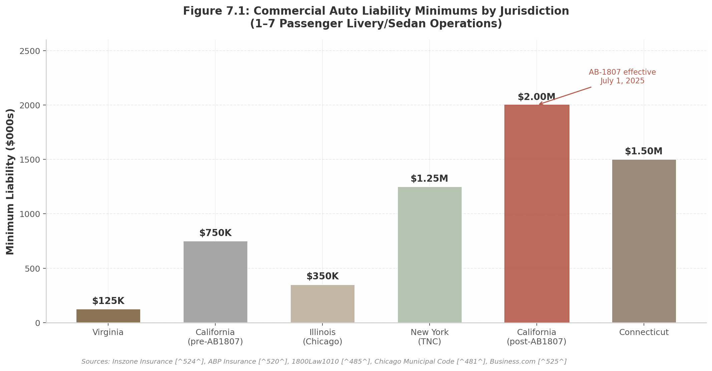

## 7. Regulatory & Compliance

The regulatory architecture governing independent driver platforms in the United States is not a coherent system — it is a layered mosaic of federal baseline standards, divergent state statutes, and hyperlocal municipal codes that together create one of the most complex compliance environments in the gig economy. For platforms positioning themselves as pure SaaS tools rather than transportation marketplaces, this fragmentation is not merely a cost of doing business; it is a structural advantage. The same regulatory patchwork that constrains Uber and Lyft — worker classification mandates, commercial insurance minimums rising to $2 million, and municipal licensing regimes — often does not apply, or applies with materially reduced force, to software vendors that merely provide scheduling and payment infrastructure to independently licensed operators.

This chapter maps the three pillars of US regulatory exposure — licensing, insurance, and classification — and then examines how the SaaS business model creates a regulatory arbitrage position relative to marketplace competitors.

### 7.1 US Regulatory Landscape

#### 7.1.1 Licensing Patchwork: No Federal Standard

At the federal level, the FMCSA sets baseline standards for Commercial Driver's Licenses (CDLs), but states issue the licenses and retain broad authority over passenger-for-hire operations below the CDL threshold. A CDL is required only for vehicles with a gross vehicle weight rating (GVWR) of 26,001+ pounds, vehicles towing 10,001+ pounds, or vehicles designed for 16 or more passengers [^475^]. The far larger market of sedan and SUV chauffeur services — vehicles carrying 14 or fewer passengers — falls entirely outside federal CDL jurisdiction, leaving each state to construct its own licensing framework [^593^].

The result is extreme heterogeneity. Michigan requires a separate chauffeur's license distinct from a standard operator's permit. Illinois requires a public passenger vehicle license. New York mandates a Class E or commercial license (A, B, or C) for TLC applicants, who must also be at least 19 years old, hold a valid Social Security number, have no more than 5 points on their DMV license within 15 months, and complete a 24-hour TLC Driver Education Course, Wheelchair Accessible Vehicle training, pass an 80-question examination (70% passing threshold), a drug test, fingerprinting, a medical exam, and sex trafficking awareness training — a process costing $500–$800 and requiring completion within 90 days [^535^] [^536^]. Effective October 1, 2025, all out-of-state TLC applicants must complete additional documentation steps at a NYS DMV office, erecting a new barrier for non-resident drivers [^535^].

California presents a different, equally demanding structure. The California Public Utilities Commission (CPUC) issues Transportation Charter Permit (TCP) licenses for charter-party carriers. Requirements include California business registration, commercial vehicle registration, a commercial insurance policy, a drug and alcohol testing program, and an application fee of $1,000 or more with processing taking 2–4 weeks [^471^]. Critically, the CPUC does not permit independent contractors to operate TCP-sanctioned vehicles unless that contractor holds their own independent TCP license — all drivers must be classified as W-2 employees of the TCP license holder [^471^]. This provision, examined in detail in Section 7.2.2, creates a structural constraint unique to the California market.

Municipal layering adds further complexity. Chicago requires all public passenger vehicles to be licensed under Chapter 9-114, with local insurance minimums of $350,000 combined single limit (CSL) for 1–9 passenger livery vehicles [^481^]. Miami-Dade County requires limousine for-hire license applications, background checks, vehicle standards meeting luxury sedan or SUV MSRP requirements, a local business tax receipt, vehicle inspections, and a county-issued chauffeur's license [^482^]. No two major markets share identical licensing requirements, and compliance costs vary by an order of magnitude across jurisdictions.

**Table 7.1: Regulatory Requirements by Jurisdiction — Selected Major Markets**

| Requirement | California (CPUC/TCP) | New York City (TLC) | Illinois (Chicago) | Florida (Miami-Dade) | Virginia |
|:---|:---|:---|:---|:---|:---|
| **Primary Regulator** | CPUC | NYC TLC | City of Chicago | Miami-Dade County | DMV / Local |
| **License Type** | TCP Permit | TLC Driver + FHV License | Public Passenger Vehicle | Limousine For-Hire License | Chauffeur / For-Hire |
| **Min. Driver Age** | 18+ | 19+ | 18+ | 21+ | 18+ |
| **ICs Permitted?** | No (W-2 only) [^471^] | Yes | Yes | Yes | Yes |
| **Insurance Min. (1–7 pax)** | $2.0M CSL [^524^] | $1.25M (TNC) [^485^] | $350K CSL [^481^] | Varies by fleet | $125K CSL [^520^] |
| **Training Required** | Drug/alcohol program | 24-hr course + WAV + exam [^536^] | None specified | Background check | Varies |
| **Vehicle Inspection** | Commercial registration | TLC pre-licensing [^478^] | Annual (GVWR >8K lbs) [^565^] | Required | Varies |
| **Application Fee** | $1,000+ | ~$500–$800 [^539^] | Varies | Varies | Varies |
| **Processing Time** | 2–4 weeks | 90-day completion window | Varies | Varies | Varies |

The table reveals a market in which regulatory entry costs range from approximately $500 in low-barrier jurisdictions to over $3,000 in TLC-regulated New York City. The IC classification column is particularly consequential: California's TCP regime is the only one among these major markets that explicitly forbids independent contractor status for drivers operating under a licensee's authority. As Section 7.2.2 will explore, this constraint applies to transportation marketplace operators — not to SaaS tool providers — creating a material competitive asymmetry.

#### 7.1.2 Insurance: Escalating Minimums and Divergent Cost Structures

Commercial auto insurance represents the single largest fixed cost for independent chauffeur operators, and the regulatory floor is rising. Commercial limo insurance for sedan and SUV operations carrying $1 million CSL coverage averages $904 per month ($10,847 annually) nationally, but geographic dispersion is extreme: Vermont operators pay $581 per month while New York TLC services pay $1,403 per month [^488^]. Stretch limousines add 25–40% to base rates; party buses add 40–75% due to federal DOT requirements and higher passenger injury exposure [^488^].

California's AB-1807, effective July 1, 2025, dramatically reshaped the cost landscape. The statute raised the state's minimum commercial auto liability for charter-party carriers and transportation network companies (TNCs) from $750,000 to $2 million CSL per vehicle — a 167% increase for sedan operators and a 33% increase for stretch limousines previously subject to $1.5 million [^524^]. The premium impact has been severe: Inszone Insurance reports that small limo fleets (1–10 vehicles) now "pay multiples of their previous liability premiums," and independent black-car drivers using SUVs or sedans who once operated under personal policies must now carry full commercial coverage [^524^]. Industry estimates place premium increases at 20–50% for operators across vehicle classes.

Figure 7.1 illustrates the divergence in commercial auto liability minimums across selected US jurisdictions. The gap between Virginia's $125,000 floor and California's post-AB-1807 $2 million ceiling represents a 16-fold variation — a range with no parallel in other developed ride-hail markets.

At the other end of the spectrum, California SB-371, effective January 1, 2026, reduced TNC uninsured/underinsured motorist coverage from $1 million per incident to $60,000 per person / $300,000 per accident, while maintaining $1 million in third-party liability when the driver is at fault [^513^] [^515^]. This divergence — rising commercial liability for charter operators while rideshare-specific coverage is reduced — creates divergent cost pressures that favor business models segmenting themselves as professional chauffeur services rather than TNC-style rideshare. A Consumer Attorneys of California-led coalition is already promoting a counter-ballot measure for November 2026 to reverse SB-371's insurance reductions [^516^], ensuring continued regulatory uncertainty.

Rideshare insurance operates on a three-period model. Uber and Lyft maintain contingent liability of $50,000 per person / $100,000 per accident during Period 1 (app on, awaiting a ride) and $1 million during Periods 2 and 3 (en route or on trip) [^495^]. Critically, this platform-provided insurance does not extend to TLC-licensed, livery, or TCP drivers, who must procure their own commercial policies consistent with state and local requirements [^495^]. New York State mandates even higher coverage: $75,000 / $150,000 / $25,000 during the waiting period and $1.25 million during active rides [^485^] [^486^].

#### 7.1.3 Classification: Federal Reversal, California Stabilization, and EU Pressure

Worker classification has been the most contested regulatory arena for driver platforms, but the political trajectory shifted decisively in 2024–2025. At the federal level, the Biden-era DOL's 2024 independent contractor final rule — which used a six-factor "economic realities" test giving no single factor predetermined weight — is no longer being enforced as of May 2025. DOL field staff have been instructed to revert to the prior Fact Sheet #13 framework, though the 2024 rule technically remains in effect for private litigation purposes [^566^] [^567^]. This reversal removes a significant reclassification risk for platforms operating under the federal Fair Labor Standards Act.

In California, the legal picture clarified with the California Supreme Court's unanimous July 25, 2024 decision in *Castellanos v. State of California*, upholding Proposition 22 against union challenges that the law violated the state constitution by infringing on workers' compensation authority [^557^] [^562^]. Under Prop 22, app-based drivers retain independent contractor status with a carve-out benefit package: a minimum earnings guarantee of 120% of minimum wage (based on "engaged time" only), healthcare stipends for qualifying workers, occupational accident insurance with a $1 million limit, and a $0.35 per mile reimbursement. They remain ineligible for sick pay, minimum wage for waiting time, unemployment insurance, and workers' compensation [^562^]. The decision provided legal certainty for platform business models in the nation's largest ride-hail market.

At the state level, a growing number of jurisdictions have codified independent contractor status for marketplace platform workers. Iowa (2018), Kentucky (2018), Tennessee (2018), Utah (2015), Texas (2019), and South Dakota (2022) have all passed statutes defining app-based platform workers as independent contractors, typically conditioned on platforms not prescribing specific hours, prohibiting use of other platforms, or restricting other work [^537^] [^543^]. The Texas Administrative Code offers a particularly detailed template, specifying eight conditions for marketplace contractor exemption from unemployment insurance: per-job payment, no hour prescription, no restriction on other platforms, no restriction on other occupations, no control over when/where work occurs, contractor responsibility for expenses and tools, no specific instructions, and no mandatory meetings [^540^].

The federal classification picture was further shaped by a January 14, 2025 FTC policy statement clarifying that independent contractors and gig workers are shielded from antitrust liability when engaging in collective bargaining and organizing activities under the Clayton and Norris-LaGuardia Acts [^545^]. While this provision empowers driver organizing, it does not alter classification status itself.

Internationally, pressure runs in the opposite direction. The EU Platform Work Directive (2024/2831) introduces a legal presumption of employment for platform workers, mandates human review of algorithmic decisions, and shifts the burden of proof from worker to platform. Member states must transpose the directive into national law by December 2, 2026 [^25^]. Belgium, Spain, and Portugal already maintain employment presumptions. The directive also restricts processing of emotional state, private conversations, and biometric data — constraints that may limit AI-powered personalization features platforms increasingly rely upon [^25^].

### 7.2 The SaaS Regulatory Arbitrage

#### 7.2.1 Pure SaaS Tool Model: Strongest IC Classification Arguments

The legal distinction between a "marketplace" that dispatches rides and a "SaaS tool" that provides scheduling, payment, and customer management software to independent operators has not been fully tested in courts for driver classification [^544^]. However, the analytical framework that courts and regulators apply points toward a decisive advantage for the SaaS model.

The DOL's Fact Sheet #13 and the six-factor "economic realities" test examine: (1) the nature and degree of the potential employer's control; (2) the permanency of the worker's relationship; (3) the worker's investment in facilities and equipment; (4) the amount of skill, initiative, and foresight required; (5) the worker's opportunities for profit or loss; and (6) the extent of integration of the worker's services into the potential employer's services [^544^]. A genuine SaaS tool that does not control pricing, routes, hours, or dispatch logic and does not restrict drivers to the platform scores favorably on at least five of six factors — most importantly the control and integration tests that carry the greatest judicial weight.

The Texas Administrative Code's eight-factor marketplace contractor framework reinforces this logic. A SaaS platform that provides scheduling and invoicing software but does not prescribe hours, prohibit multi-homing, restrict other occupations, control when or where work occurs, or require attendance at mandatory meetings structurally satisfies the conditions for independent contractor classification [^540^]. By contrast, marketplace platforms that set rates, control dispatch algorithms, and require driver availability windows exercise precisely the forms of control that courts have found most probative of an employment relationship.

This classification advantage translates directly to unit economics. Full employee classification would increase platform labor costs by an estimated 20–30% through the addition of payroll taxes, workers' compensation, unemployment insurance, and benefits administration [^497^]. The SaaS model's stronger IC classification arguments reduce this reclassification risk materially, creating a structural cost advantage that compounds as marketplace competitors face ongoing litigation exposure.

#### 7.2.2 CA TCP Requires W-2: Constraint for Marketplaces, Not SaaS Tools

California's TCP regime presents what appears to be a prohibitive constraint: the CPUC explicitly forbids independent contractors from operating TCP-sanctioned vehicles unless the contractor holds their own independent TCP license, effectively mandating W-2 employee classification for all drivers operating under a carrier's authority [^471^]. For transportation marketplace operators that directly dispatch rides and control the driver-passenger relationship, this requirement imposes the full cost burden of employee classification on California operations.

The SaaS tool model navigates around this constraint through structural separation. If the platform does not dispatch rides, does not hold TCP authority, and does not control the driver-passenger contractual relationship — instead merely providing software that independent TCP license holders use to manage their own client bookings — the W-2 mandate falls on the licensed carrier, not on the software vendor. The driver is the employee of the TCP-licensed operator (or holds their own TCP license as an independent carrier), while the SaaS platform provides tooling to that operator exactly as Salesforce provides CRM software to a licensed insurance broker.

This distinction is not semantic; it is structural. The CPUC's W-2 requirement applies to "anyone operating [a vehicle] as a driver for [the TCP license holder's] business" [^471^] — language that targets the vehicle operator, not the software provider. A SaaS booking platform that enables a TCP-licensed carrier to accept reservations, process payments, and manage client relationships does not itself "operate" vehicles or employ drivers, and therefore falls outside the TCP classification mandate. This regulatory arbitrage is unique to California — no other major US jurisdiction couples licensing requirements so directly to employment classification — but it is precisely California's scale that makes the arbitrage most valuable.

#### 7.2.3 Data Privacy: CCPA, PCI DSS, and GDPR

The SaaS model's reduced regulatory exposure does not eliminate compliance obligations. Data privacy requirements apply with equal force regardless of business model classification.

For platforms handling California consumer data, the CCPA/CPRA regime imposes substantial obligations. The California Privacy Protection Agency initiated its first-ever enforcement review of connected vehicle manufacturers in July 2023, examining how companies collect and use driver, passenger, and bystander data [^494^]. Platforms that provide passenger data to third parties for targeted advertising are engaged in "sharing" under CPRA and must ensure adequate notice in privacy policies regarding geolocation data and sensitive personal information [^484^]. Violations carry maximum fines of $7,500 per violation for intentional noncompliance and $2,500 for unintentional violations, plus private rights of action for data breaches with statutory damages up to $750 per affected individual [^487^].

PCI DSS compliance is mandatory for any SaaS provider whose applications handle cardholder data, including platforms that embed payments via third-party integrations [^541^]. The twelve PCI DSS requirement domains — spanning network security, data encryption, access control, logging, and vulnerability management — apply regardless of transaction volume or platform business model.

For any platform with EU drivers or passengers, GDPR compliance carries even higher stakes. In August 2024, the Dutch Data Protection Authority imposed a EUR 290 million fine on Uber for improperly transferring European driver data to US servers between August 2021 and November 2023 without proper safeguards, including account details, taxi licenses, location data, photos, payment details, identity documents, and criminal or medical records [^598^]. The EU Platform Work Directive adds further constraints, requiring human review of algorithmic management decisions and restricting processing of biometric and behavioral data [^25^].

The net regulatory position for a SaaS-structured driver platform can be summarized as follows: licensing complexity falls on the independent operators, not the platform; insurance requirements are borne by the licensed carriers; worker classification obligations are substantially reduced; and data privacy compliance remains fully applicable. This asymmetry — reduced exposure in the three domains that constitute the majority of regulatory cost (licensing, insurance, and classification) while maintaining standard obligations in data privacy — is the core of the regulatory arbitrage. It is not a loophole but a function of correct structural design: a software company that sells tools to independent professionals faces different, and materially lighter, regulatory obligations than a company that employs or dispatches those professionals directly.
