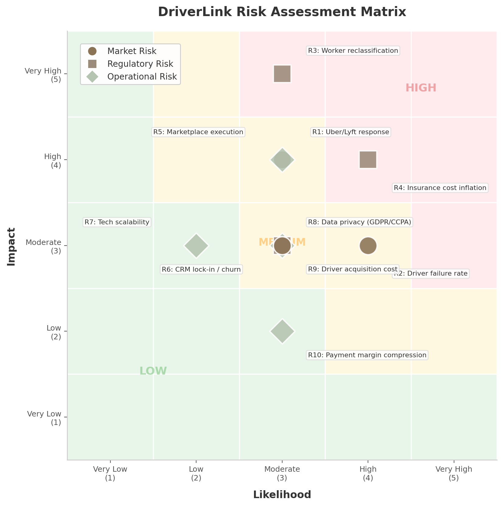

## 9. Risk Assessment & Mitigation

Every vertical SaaS platform faces a tension between the opportunity it captures and the hazards it inherits. For DriverLink, the risks cluster into three domains: market-level competitive and supply-side threats, regulatory classification and cost pressures, and operational execution challenges inherent to two-sided platform mechanics. The following matrix summarizes the ten most material risks, scored by likelihood and impact on a 1–5 scale.

| Risk ID | Risk Description | Category | Likelihood | Impact | Risk Score | Mitigation Strategy |
|:---:|---|---|:---:|:---:|:---:|---|
| R1 | Uber/Lyft launch chauffeur SaaS tools or acquire Anolla | Market | 3 | 4 | 12 | SaaS-not-marketplace positioning; CRM lock-in; brand ownership |
| R2 | 47.4% five-year failure rate for independent transport businesses [^36^] | Market | 4 | 3 | 12 | Revenue analytics; demand generation; capital access; insurance group buying |
| R3 | Worker reclassification under ABC test or EU Platform Work Directive [^471^] [^475^] | Regulatory | 3 | 5 | 15 | Pure SaaS tool model (no dispatch/pricing control); no exclusivity restrictions |
| R4 | Insurance cost inflation following AB-1807-type legislation [^524^] | Regulatory | 4 | 4 | 16 | Embedded group insurance; 15–30% commission capture; risk pool aggregation |
| R5 | Two-sided marketplace chicken-and-egg problem | Operational | 3 | 4 | 12 | "Come for the tool, stay for the network" sequencing; OpenTable playbook [^449^] |
| R6 | CRM lock-in failure and subscription churn above 5% monthly | Operational | 3 | 3 | 9 | Customer data gravity; export friction; embedded fintech stickiness [^741^] |
| R7 | PWA-first architecture limitations (no iOS push, no background GPS) | Operational | 2 | 3 | 6 | Capacitor native wrapper; deferred native driver app until GPS required |
| R8 | Data privacy enforcement under GDPR / CCPA [^598^] [^494^] | Regulatory | 3 | 3 | 9 | Data residency design; PCI DSS compliance; minimal data collection |
| R9 | Driver acquisition cost inflation above $600 | Market | 3 | 3 | 9 | Uber disillusionment pipeline; driver-to-driver referrals; NLA partnerships |
| R10 | Payment processing margin compression | Operational | 3 | 2 | 6 | Proprietary PayFac at $50M+ GPV; multi-processor arbitrage |

*Risk Score = Likelihood x Impact. Scores 1–6 = Low (green), 7–12 = Medium (yellow), 13–25 = High (red).*

The risk landscape reveals a critical insight: regulatory risks (R3, R4) carry the highest combined scores, while market risks (R1, R2) are most probable. Operational risks cluster in the medium zone but become acute if marketplace execution fails. The matrix suggests DriverLink's risk profile is asymmetric — regulatory missteps could be existential, while market and operational risks are manageable with disciplined execution.

### 9.1 Market Risks

#### 9.1.1 Uber/Lyft Competitive Response — Mitigated by SaaS-Not-Marketplace Positioning

The most visible competitive threat is a direct response from Uber or Lyft. Uber's acquisition of Blacklane (March 2026, undisclosed terms) [^18^] and launch of Uber Elite [^46^] signal aggressive premium segment expansion. Lyft's acquisition of TBR Global for £83 million [^17^] and Gett's UK operations for £40 million [^113^] demonstrate similar intent. Either platform could theoretically extend its driver toolset into standalone SaaS offerings or acquire Anolla — the closest existing comparable.

The mitigation, however, is structural. Uber and Lyft are fundamentally marketplace businesses; their entire economics depend on controlling the rider-driver transaction. Uber's take rate has climbed from 10% to 40%+ [^13^], and the company's strategic pivot toward autonomous vehicles (100,000 Waymo robotaxis targeted by 2027) [^2^] signals reduced long-term reliance on human drivers. A SaaS-tool offering that helps drivers go independent would directly cannibalize Uber's supply base — creating an internal conflict that makes such a move strategically irrational. Blacklane's partner model provides "complete schedule control" and "reliable direct payment" [^29^], but it remains a demand platform, not a business operating system. DriverLink's positioning as "Squarespace for chauffeurs" rather than "Uber for independents" creates a competitive moat that marketplace incumbents cannot cross without undermining their core business model.

#### 9.1.2 Driver Acquisition: 47.4% Five-Year Failure Rate for Independents

The transportation and warehousing industry exhibits a 20.4% first-year business failure rate, rising to 47.4% by year five and 63.9% by year ten [^36^] — placing it in the bottom half of all industries for survival. This statistic represents both a risk and an opportunity: every failed independent driver is a churned customer, but the high failure rate is driven by precisely the pain points DriverLink addresses.

Research identifies the primary failure drivers as cash flow disruption (56% of small businesses wait on unpaid invoices) [^25^], customer acquisition failure (the #1 cited challenge for independents) [^21^], and lack of integrated business tools (70% of small fleets still use manual scheduling) [^95^]. The mitigation strategy maps directly onto these causes: embedded payment processing with automated invoicing reduces collection cycles from 30+ days to instant; marketplace demand generation provides a predictable client pipeline; and the all-in-one SaaS tool replaces the fragmented stack of WhatsApp, Google Calendar, and spreadsheets that currently dominates independent operations [^23^]. Targeting recently departed Uber Black/Reserve drivers — a population actively seeking independence as Uber's take rates rise and AV deployment threatens human driver roles — provides a captured recruitment pipeline that lowers CAC toward the $300–$400 range [^751^].

### 9.2 Regulatory Risks

#### 9.2.1 Reclassification Risk — SaaS Tool Model Provides Strongest Defense

Worker classification represents the single highest-impact risk on the matrix (R3: score 15). California's AB5 codified the ABC test, which presumes all workers are employees unless the hiring entity can demonstrate the worker is (A) free from control, (B) outside the usual course of business, and (C) customarily engaged in an independent trade [^490^]. Critically, CPUC regulations require all TCP-licensed vehicle operators in California to be classified as W-2 employees of the TCP license holder — independent contractors cannot operate TCP-listed vehicles [^471^]. At the federal level, the DOL's 2024 independent contractor rule is no longer being enforced as of May 2025, but remains in effect for private litigation [^566^]. Internationally, the EU Platform Work Directive (2024/2831) creates a rebuttable employment presumption for "platforms" effective December 2026 [^475^].

The defense is architectural. A pure SaaS tool that provides scheduling, invoicing, and client management — without controlling dispatch, pricing, hours, or restricting drivers to the platform — falls outside the statutory definition of a "platform" or "transportation network company." The DOL's Fact Sheet #13 framework examines control, integration, and economic dependence as primary factors [^544^]. By never dispatching rides, never setting prices, and never restricting multi-homing, DriverLink positions itself as a software provider, not an employer or marketplace operator. This distinction, while legally untested in chauffeur-specific contexts, aligns with the seven-factor Texas Administrative Code test for marketplace contractors, which explicitly exempts platforms that do not prescribe hours, control work locations, or restrict use of other platforms [^540^]. The "Squarespace for chauffeurs" positioning is not merely a marketing frame — it is a legal firewall.

#### 9.2.2 Insurance Cost Inflation — AB-1807-Type Legislation Spreading

California's AB-1807, effective July 1, 2025, raised minimum commercial auto liability from $750,000 to $2 million combined single limit per vehicle — driving premium increases of 20–50% for many operators [^524^]. Commercial limo insurance already averages $904/month nationally, with NYC TLC services at $1,403/month [^488^]. Over half of all rideshare drivers lack proper gap coverage [^492^], and the trend toward higher minimums is accelerating: New York State now requires $1.25 million during active rides [^485^], and Uber reports insurance costs exceeding 25% of fares in New York and New Jersey [^485^].

The mitigation strategy transforms insurance from a cost center into a revenue stream. By aggregating thousands of independent drivers into a collective risk pool, DriverLink can negotiate 20–40% premium reductions through group buying — validated by the National Limousine Association's existing affinity programs (40% off background checks and fuel cards) [^109^]. Insurance commissions of 15–30% on premiums averaging $5,000–$15,000 annually generate $750–$6,480 per policy in near-pure margin [^733^]. At scale, this single feature could add $500–$1,500 in annual revenue per driver — matching or exceeding the SaaS subscription itself. The strategy follows Toast's embedded finance playbook: use transaction data to underwrite risk, then capture the distribution margin [^741^].

### 9.3 Operational Risks

#### 9.3.1 Two-Sided Marketplace Execution — CRM Lock-In and Subscription Retention

The chicken-and-egg problem — riders won't join without drivers, drivers won't join without riders — is the classic platform execution risk (R5: score 12). Uber solved this by focusing supply-side first, paying drivers $20–$30/hour guarantees during 60–90 day launch periods, and treating each city as its own startup with a 180-step playbook [^425^] [^435^]. For DriverLink, the sequencing strategy is different but equally deliberate: the "come for the tool, stay for the network" approach, validated by OpenTable's SaaS-first restaurant reservation system [^449^] and Toast's 118% annual growth from POS-first expansion [^438^].

The core insight is that premium chauffeur services are relationship-based, not algorithm-based [^512^]. Network effects in this segment are asymptotic — they deliver diminishing returns after approximately 4-minute pickup times, which is irrelevant for pre-booked chauffeur services [^512^]. This means CRM lock-in, not marketplace density, is the primary defensibility mechanism. As drivers build customer profiles, booking histories, payment methods, and preference notes on DriverLink, switching costs increase non-linearly. A driver with 200 customer profiles and years of history faces massive friction to migrate to any competitor — even one with superior marketplace liquidity. This "data moat" is reinforced by embedding financial services: BCG/Adyen research shows embedded payment strategies retain customers at 2.5x the rate of traditional providers [^147^]. The target NRR of 105–115% [^689^] is achievable through tier upgrades ($49 → $99 → $199/month), add-on adoption (SMS marketing, branded apps), and processing volume growth as driver businesses scale.

#### 9.3.2 Technology Scalability — PWA-First De-Risks Mobile

Building native iOS and Android applications simultaneously with the core SaaS platform introduces scope creep, cost inflation, and delayed time-to-market. The PWA-first approach reduces mobile development costs by 40–60% and accelerates launch by 50–70% [^20^], but carries a known limitation: iOS PWAs cannot send push notifications [^21^], which is critical for real-time booking alerts and driver status updates.

The mitigation is staged. Phase 1 deploys a PWA for both rider booking and driver companion functionality — sufficient for the SaaS-first launch where real-time GPS tracking is not yet required. Phase 2 adds a Capacitor native wrapper to enable push notifications without rewriting the application. Phase 3 builds a native driver app only when continuous GPS tracking and background location services become essential — a milestone likely reached at 5,000+ active drivers when dispatch optimization requires real-time position data. This staged approach follows the CloudTrucks model ($141.6M raised, $850M valuation), which built its "business in a box" for truckers using a responsive web-first approach before adding native features [^108^]. On the backend, PostgreSQL with Row-Level Security handles multi-tenancy at scale — benchmarks show 94.74% query performance improvement with proper RLS filter optimization [^16^] — and Stripe Connect Express enables driver onboarding in under two minutes with automatic KYC verification [^17^].

The technology risk is further de-risked by the vertical SaaS precedent. Toast serves ~164,000 restaurant locations with annualized revenue exceeding $2.0 billion [^220^]; Shopify powers millions of merchants [^721^]; and GlossGenius reached $100M ARR with only $17.6M in funding [^27^]. The infrastructure patterns — multi-tenant PostgreSQL, Stripe Connect, serverless deployment on Vercel/AWS — are proven at orders of magnitude beyond DriverLink's projected scale. The risk is not technical feasibility; it is execution sequencing. Prioritizing standalone SaaS utility over marketplace features in the first 12–18 months aligns product development with the platform's primary retention mechanism and its most powerful regulatory defense.
